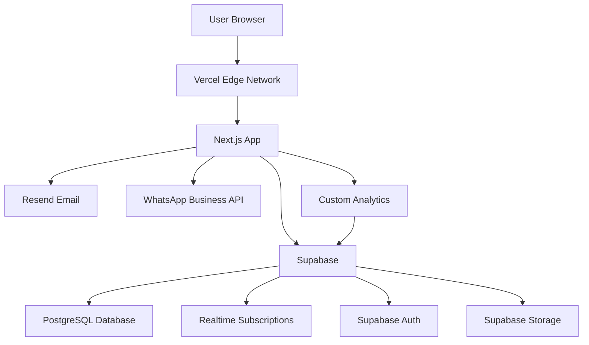
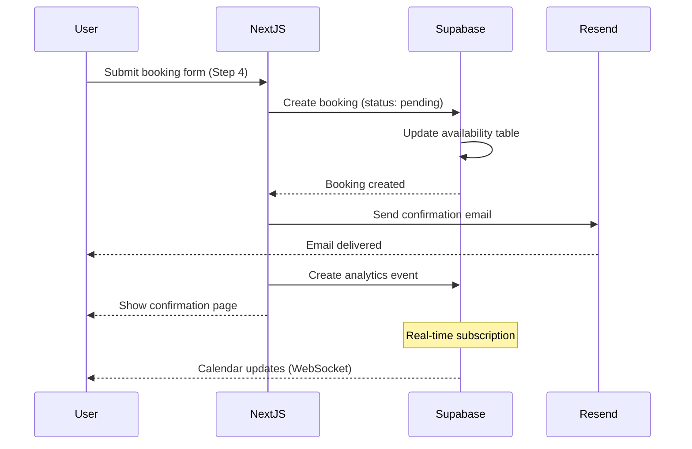
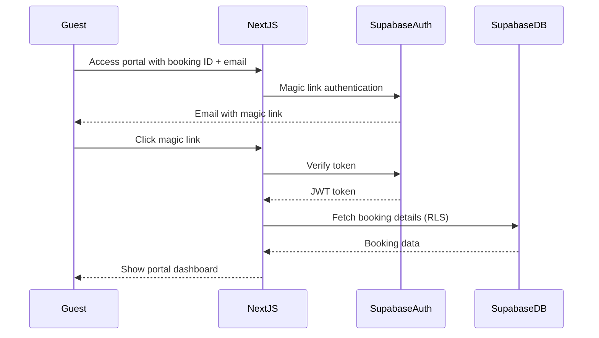

# Tech Plan: Next.js + Supabase Architecture

## Architectural Approach

### Technology Stack

**Frontend:**

- **Next.js 14+** (App Router, React Server Components)
- **TailwindCSS** (styling, već implementirano)
- **React 18** (server/client components)
- **TypeScript** (type safety)

**Backend & Database:**

- **Supabase** (PostgreSQL + real-time + auth + storage + edge functions)
- **PostgreSQL** (relational database via Supabase)
- **Supabase Realtime** (WebSocket subscriptions za kalendar)
- **Supabase Auth** (admin + guest portal authentication)
- **Supabase Storage** (image uploads)

**Services:**

- **Resend** (email notifications sa React Email templates)
- **WhatsApp Business API** (live chat)
- **Vercel** (hosting, edge functions, CDN)

**Analytics:**

- **Custom lightweight tracking** (Supabase database + edge functions)

### Key Architectural Decisions

#### 1. Next.js 14 App Router (SSR/SSG for SEO)

**Decision:** Migrate from Vite CSR to Next.js 14 App Router.

**Rationale:**

- **SEO Priority #1:** Server-Side Rendering ensures Google crawlers see full HTML
- **Static Generation:** Pre-render pages at build time for instant loads
- **React Server Components:** Reduce client-side JavaScript, faster page loads
- **Image Optimization:** Automatic WebP conversion, lazy loading, responsive images
- **API Routes:** Built-in API endpoints (alternative to separate Express server)

**Trade-offs:**

- ✅ Best-in-class SEO, Core Web Vitals optimization
- ✅ Vercel integration (automatic deployments, edge network)
- ✅ Developer experience (file-based routing, server actions)
- ❌ Requires migration from Vite (refactor existing components)
- ❌ Learning curve for App Router (different from Pages Router)

**Implementation Strategy:**

- Use **Static Site Generation (SSG)** for: Homepage, Gallery, Prices, Attractions, Contact
- Use **Server-Side Rendering (SSR)** for: Booking flow (dynamic availability)
- Use **Client Components** for: Interactive calendar, forms, modals
- Use **Server Actions** for: Form submissions, booking requests

#### 2. Supabase as Backend-as-a-Service

**Decision:** Use Supabase for database, auth, storage, and real-time.

**Rationale:**

- **PostgreSQL:** ACID compliance for booking transactions
- **Real-time Subscriptions:** WebSocket-based calendar updates (built-in)
- **Row Level Security (RLS):** Database-level authorization
- **Supabase Auth:** JWT-based authentication (admin + guests)
- **Supabase Storage:** Image uploads with CDN
- **Edge Functions:** Serverless functions for webhooks, cron jobs

**Trade-offs:**

- ✅ All-in-one solution (database, auth, storage, real-time)
- ✅ Generous free tier (500MB database, 1GB storage, 2GB bandwidth)
- ✅ Automatic backups, point-in-time recovery
- ✅ Built-in real-time (no need for separate WebSocket server)
- ❌ Vendor lock-in (but PostgreSQL is portable)
- ❌ Cold starts on free tier (< 1s, acceptable)

**Migration from JSON Files:**

- Migrate content from backend/data/*.json to PostgreSQL tables
- Keep multi-language support (4 languages: sr, en, it, de)
- Migrate images from file:backend/uploads/ to Supabase Storage

#### 3. Real-Time Calendar with Supabase Subscriptions

**Decision:** Use Supabase real-time subscriptions for calendar updates.

**Rationale:**

- **Built-in WebSockets:** No need for separate Socket.io server
- **Automatic Sync:** Calendar updates propagate to all connected clients
- **Optimistic Updates:** Instant UI feedback, sync in background
- **Conflict Resolution:** PostgreSQL transactions prevent double-bookings

**Trade-offs:**

- ✅ Real-time updates without custom WebSocket server
- ✅ Scales automatically with Supabase infrastructure
- ✅ Works with Vercel serverless (no persistent connections needed)
- ❌ Requires Supabase client library (adds ~50KB)

**Implementation:**

```typescript
// Subscribe to availability changes
const subscription = supabase
  .channel('availability-changes')
  .on('postgres_changes', {
    event: '*',
    schema: 'public',
    table: 'availability'
  }, (payload) => {
    // Update calendar UI
  })
  .subscribe()
```

#### 4. Resend for Email Notifications

**Decision:** Use Resend with React Email templates.

**Rationale:**

- **React Email:** Write email templates in React (reuse components)
- **Developer Experience:** Modern API, TypeScript support
- **Deliverability:** Good inbox placement
- **Free Tier:** 100 emails/day (sufficient for 4 apartmana)

**Trade-offs:**

- ✅ React templates (consistent with Next.js stack)
- ✅ Simple API, good documentation
- ✅ Free tier sufficient for current scale
- ❌ Relatively new service (less proven than SendGrid)

**Email Flow:**

1. **Booking Request Received** → Instant confirmation email
2. **Booking Confirmed** → Confirmation email (< 2 sata)
3. **7 Days Before Arrival** → Pre-arrival information
4. **24 Hours Before Arrival** → Check-in instructions
5. **After Checkout** → Review request

#### 5. WhatsApp Business API for Live Chat

**Decision:** Use WhatsApp Business API instead of custom chat.

**Rationale:**

- **User Familiarity:** Korisnici već koriste WhatsApp
- **Mobile-First:** WhatsApp je optimizovan za mobilne uređaje
- **Business Hours:** Lako postaviti auto-replies van radnog vremena (9-21h)
- **Rich Media:** Slike, dokumenti, lokacija

**Trade-offs:**

- ✅ Korisnici već imaju WhatsApp (no app install)
- ✅ Push notifications (WhatsApp handles)
- ✅ Conversation history (WhatsApp stores)
- ❌ Zahteva WhatsApp Business API setup (verifikacija)
- ❌ Nije integrisano u sajt (external app)

**Implementation:**

- Floating WhatsApp button sa pre-filled message
- Click-to-WhatsApp link: `https://wa.me/381693349457?text=Zdravo!%20Interesuje%20me%20rezervacija...`
- Business hours auto-reply (9-21h)

#### 6. Custom Analytics (Lightweight)

**Decision:** Build custom analytics instead of Google Analytics.

**Rationale:**

- **Privacy:** No third-party tracking, GDPR compliant
- **Performance:** Lightweight (< 1KB), no external scripts
- **Control:** Track exactly what you need
- **Cost:** Free (stored in Supabase)

**Trade-offs:**

- ✅ Full control, privacy-friendly
- ✅ Lightweight, fast page loads
- ✅ Custom events for booking funnel
- ❌ No pre-built dashboards (need to build)
- ❌ No industry benchmarks

**Tracked Events:**

- Page views (with referrer, device, language)
- Booking funnel steps (step 1-4 completion rates)
- CTA clicks (which CTAs convert best)
- Calendar interactions (date selections)
- Bounce rate, time on site

#### 7. Vercel Hosting with Edge Network

**Decision:** Deploy Next.js to Vercel, Supabase separate.

**Rationale:**

- **Vercel + Next.js:** Best-in-class integration
- **Global CDN:** Edge network for fast loads worldwide
- **Automatic Deployments:** Git push → deploy
- **Preview Deployments:** Every PR gets preview URL
- **Edge Functions:** Run code close to users

**Trade-offs:**

- ✅ Zero-config deployments
- ✅ Automatic HTTPS, custom domain support
- ✅ Edge caching for static pages
- ✅ Free tier (100GB bandwidth, sufficient)
- ❌ Serverless functions have cold starts (< 1s)

**Deployment Strategy:**

- **Production:** `main` branch → `apartmani-jovca.vercel.app`
- **Staging:** `staging` branch → `staging.apartmani-jovca.vercel.app`
- **Preview:** Feature branches → `pr-123.vercel.app`

### Migration Strategy from Current Stack

**Phase 1: Setup New Infrastructure**

1. Create Supabase project
2. Create Next.js 14 project (App Router)
3. Setup Vercel deployment
4. Configure custom domain

**Phase 2: Migrate Content & Data**

1. Migrate JSON content to PostgreSQL tables
2. Migrate images to Supabase Storage
3. Setup multi-language content structure
4. Migrate admin authentication to Supabase Auth

**Phase 3: Rebuild Pages with SSR/SSG**

1. Homepage (SSG)
2. Gallery (SSG with dynamic images)
3. Prices (SSG)
4. Attractions (SSG)
5. Contact (SSG)

**Phase 4: Build New Features**

1. Booking system (4-step flow)
2. Real-time calendar
3. Guest portal
4. Email notifications (Resend)
5. WhatsApp integration
6. Custom analytics

**Phase 5: PWA & Optimizations**

1. Service worker
2. Offline support
3. Install prompt
4. Push notifications (optional)

### Constraints & Considerations

**Technical Constraints:**

- **Supabase Free Tier Limits:**
  - 500MB database (sufficient for 4 apartmana + bookings)
  - 1GB storage (sufficient for images)
  - 2GB bandwidth/month (may need upgrade with traffic)
  - 50,000 monthly active users (more than sufficient)

**Business Constraints:**

- **4 Apartmana:** Current scale, possible expansion
- **< 50 Rezervacija/mesec:** Expected after transformation
- **Budget:** 50.000 EUR (sufficient for development + 1 year hosting)

**Regulatory Constraints:**

- **GDPR:** Custom analytics ensures compliance
- **Cookie Consent:** Required for any tracking
- **Data Retention:** Define policies for guest data

### Performance Targets

**Core Web Vitals (Google SEO):**

- **LCP (Largest Contentful Paint):** < 2.5s
- **FID (First Input Delay):** < 100ms
- **CLS (Cumulative Layout Shift):** < 0.1

**Page Load Times:**

- **Homepage:** < 1s (SSG + edge caching)
- **Booking Flow:** < 2s (SSR with data fetching)
- **Calendar:** < 500ms (real-time updates)

**SEO Targets:**

- **#1 on Google** for "apartmani bovansko jezero"
- **Rich Snippets:** Ratings, prices, availability
- **Mobile-First Indexing:** Perfect mobile experience

---

## Data Model

### Database Schema (Supabase PostgreSQL)

#### Core Tables

**1. apartments**

```sql
CREATE TABLE apartments (
  id UUID PRIMARY KEY DEFAULT uuid_generate_v4(),
  name JSONB NOT NULL, -- {"sr": "Apartman Deluxe", "en": "Deluxe Apartment", ...}
  description JSONB NOT NULL,
  capacity INT NOT NULL,
  bed_type JSONB NOT NULL,
  amenities JSONB[], -- ["wifi", "parking", "lake_view", ...]
  base_price_eur DECIMAL(10,2) NOT NULL,
  images JSONB[], -- [{"url": "...", "alt": "...", "order": 1}, ...]
  status TEXT DEFAULT 'active', -- 'active', 'inactive', 'maintenance'
  created_at TIMESTAMPTZ DEFAULT NOW(),
  updated_at TIMESTAMPTZ DEFAULT NOW()
);

-- Indexes
CREATE INDEX idx_apartments_status ON apartments(status);
```

**2. bookings**

```sql
CREATE TABLE bookings (
  id UUID PRIMARY KEY DEFAULT uuid_generate_v4(),
  booking_number TEXT UNIQUE NOT NULL, -- "BJ-2024-0123"
  apartment_id UUID REFERENCES apartments(id),
  guest_id UUID REFERENCES guests(id),
  
  -- Dates
  check_in DATE NOT NULL,
  check_out DATE NOT NULL,
  nights INT GENERATED ALWAYS AS (check_out - check_in) STORED,
  
  -- Guest info
  num_guests INT NOT NULL,
  arrival_time TEXT, -- "14-16h", "16-18h", etc.
  
  -- Status
  status TEXT DEFAULT 'pending', -- 'pending', 'confirmed', 'cancelled', 'completed'
  
  -- Pricing
  price_per_night DECIMAL(10,2) NOT NULL,
  total_price DECIMAL(10,2) NOT NULL,
  
  -- Options
  options JSONB DEFAULT '[]', -- ["crib", "early_checkin", ...]
  special_requests TEXT,
  
  -- Timestamps
  requested_at TIMESTAMPTZ DEFAULT NOW(),
  confirmed_at TIMESTAMPTZ,
  cancelled_at TIMESTAMPTZ,
  completed_at TIMESTAMPTZ,
  
  -- Metadata
  source TEXT DEFAULT 'website', -- 'website', 'phone', 'email'
  language TEXT DEFAULT 'sr',
  
  created_at TIMESTAMPTZ DEFAULT NOW(),
  updated_at TIMESTAMPTZ DEFAULT NOW()
);

-- Indexes
CREATE INDEX idx_bookings_apartment ON bookings(apartment_id);
CREATE INDEX idx_bookings_guest ON bookings(guest_id);
CREATE INDEX idx_bookings_dates ON bookings(check_in, check_out);
CREATE INDEX idx_bookings_status ON bookings(status);

-- Constraint: No overlapping bookings
CREATE UNIQUE INDEX idx_no_overlap ON bookings(apartment_id, daterange(check_in, check_out, '[]'))
WHERE status IN ('confirmed', 'pending');
```

**3. guests**

```sql
CREATE TABLE guests (
  id UUID PRIMARY KEY DEFAULT uuid_generate_v4(),
  
  -- Contact info
  full_name TEXT NOT NULL,
  email TEXT NOT NULL,
  phone TEXT NOT NULL,
  
  -- Auth (for guest portal)
  auth_user_id UUID REFERENCES auth.users(id),
  
  -- Preferences
  language TEXT DEFAULT 'sr',
  
  -- Stats
  total_bookings INT DEFAULT 0,
  total_nights INT DEFAULT 0,
  
  created_at TIMESTAMPTZ DEFAULT NOW(),
  updated_at TIMESTAMPTZ DEFAULT NOW()
);

-- Indexes
CREATE INDEX idx_guests_email ON guests(email);
CREATE INDEX idx_guests_auth ON guests(auth_user_id);
```

**4. availability**

```sql
CREATE TABLE availability (
  id UUID PRIMARY KEY DEFAULT uuid_generate_v4(),
  apartment_id UUID REFERENCES apartments(id),
  date DATE NOT NULL,
  
  -- Availability
  is_available BOOLEAN DEFAULT true,
  price_override DECIMAL(10,2), -- Override base price for specific dates
  
  -- Reason for unavailability
  reason TEXT, -- 'booked', 'maintenance', 'blocked'
  booking_id UUID REFERENCES bookings(id),
  
  created_at TIMESTAMPTZ DEFAULT NOW(),
  updated_at TIMESTAMPTZ DEFAULT NOW(),
  
  UNIQUE(apartment_id, date)
);

-- Indexes
CREATE INDEX idx_availability_apartment_date ON availability(apartment_id, date);
CREATE INDEX idx_availability_date ON availability(date);
```

**5. reviews**

```sql
CREATE TABLE reviews (
  id UUID PRIMARY KEY DEFAULT uuid_generate_v4(),
  booking_id UUID REFERENCES bookings(id),
  guest_id UUID REFERENCES guests(id),
  apartment_id UUID REFERENCES apartments(id),
  
  -- Rating
  rating INT CHECK (rating >= 1 AND rating <= 5),
  
  -- Review content
  title TEXT,
  comment TEXT,
  
  -- Guest photos (optional)
  photos JSONB[], -- [{"url": "...", "caption": "..."}, ...]
  
  -- Status
  status TEXT DEFAULT 'pending', -- 'pending', 'approved', 'rejected'
  approved_at TIMESTAMPTZ,
  
  -- Metadata
  language TEXT DEFAULT 'sr',
  
  created_at TIMESTAMPTZ DEFAULT NOW(),
  updated_at TIMESTAMPTZ DEFAULT NOW()
);

-- Indexes
CREATE INDEX idx_reviews_apartment ON reviews(apartment_id);
CREATE INDEX idx_reviews_status ON reviews(status);
CREATE INDEX idx_reviews_rating ON reviews(rating);
```

**6. messages** (Guest Portal Communication)

```sql
CREATE TABLE messages (
  id UUID PRIMARY KEY DEFAULT uuid_generate_v4(),
  booking_id UUID REFERENCES bookings(id),
  sender_type TEXT NOT NULL, -- 'guest', 'admin'
  sender_id UUID, -- guest_id or admin user_id
  
  -- Message content
  content TEXT NOT NULL,
  attachments JSONB[], -- [{"url": "...", "type": "image", "name": "..."}, ...]
  
  -- Status
  read_at TIMESTAMPTZ,
  
  created_at TIMESTAMPTZ DEFAULT NOW()
);

-- Indexes
CREATE INDEX idx_messages_booking ON messages(booking_id);
CREATE INDEX idx_messages_created ON messages(created_at DESC);
```

**7. content** (Multi-language CMS)

```sql
CREATE TABLE content (
  id UUID PRIMARY KEY DEFAULT uuid_generate_v4(),
  key TEXT NOT NULL, -- 'home.hero.title', 'prices.description', etc.
  language TEXT NOT NULL,
  value JSONB NOT NULL, -- Flexible content (text, rich text, arrays, etc.)
  
  created_at TIMESTAMPTZ DEFAULT NOW(),
  updated_at TIMESTAMPTZ DEFAULT NOW(),
  
  UNIQUE(key, language)
);

-- Indexes
CREATE INDEX idx_content_key_lang ON content(key, language);
```

**8. analytics_events** (Custom Analytics)

```sql
CREATE TABLE analytics_events (
  id UUID PRIMARY KEY DEFAULT uuid_generate_v4(),
  
  -- Event
  event_type TEXT NOT NULL, -- 'page_view', 'booking_step', 'cta_click', etc.
  event_data JSONB, -- Flexible event properties
  
  -- Session
  session_id TEXT,
  user_id UUID, -- If authenticated
  
  -- Context
  page_url TEXT,
  referrer TEXT,
  device_type TEXT, -- 'mobile', 'tablet', 'desktop'
  browser TEXT,
  language TEXT,
  
  -- Geo (from Vercel edge)
  country TEXT,
  city TEXT,
  
  created_at TIMESTAMPTZ DEFAULT NOW()
);

-- Indexes
CREATE INDEX idx_analytics_event_type ON analytics_events(event_type);
CREATE INDEX idx_analytics_created ON analytics_events(created_at DESC);
CREATE INDEX idx_analytics_session ON analytics_events(session_id);

-- Partitioning by month (for performance)
-- CREATE TABLE analytics_events_2024_05 PARTITION OF analytics_events
-- FOR VALUES FROM ('2024-05-01') TO ('2024-06-01');
```

#### Row Level Security (RLS) Policies

**Apartments:** Public read, admin write

```sql
ALTER TABLE apartments ENABLE ROW LEVEL SECURITY;

CREATE POLICY "Public can view active apartments"
  ON apartments FOR SELECT
  USING (status = 'active');

CREATE POLICY "Admins can manage apartments"
  ON apartments FOR ALL
  USING (auth.jwt() ->> 'role' = 'admin');
```

**Bookings:** Guests can view their own, admins can view all

```sql
ALTER TABLE bookings ENABLE ROW LEVEL SECURITY;

CREATE POLICY "Guests can view their bookings"
  ON bookings FOR SELECT
  USING (guest_id = auth.uid());

CREATE POLICY "Admins can manage all bookings"
  ON bookings FOR ALL
  USING (auth.jwt() ->> 'role' = 'admin');
```

**Reviews:** Public read approved, guests can create

```sql
ALTER TABLE reviews ENABLE ROW LEVEL SECURITY;

CREATE POLICY "Public can view approved reviews"
  ON reviews FOR SELECT
  USING (status = 'approved');

CREATE POLICY "Guests can create reviews for their bookings"
  ON reviews FOR INSERT
  WITH CHECK (guest_id = auth.uid());
```

### Data Migration from JSON Files

**Current Structure:**

- file:backend/data/sr.json, `en.json`, `it.json`, `de.json`
- Nested structure: `{ home: {...}, gallery: {...}, prices: {...} }`

**Migration Strategy:**

1. Flatten JSON structure into `content` table with keys
2. Example: `home.hero.title` → `{"sr": "Dobrodošli...", "en": "Welcome..."}`
3. Migrate images to Supabase Storage
4. Update image URLs in content

**Migration Script:**

```typescript
// Pseudo-code for migration
const migrateContent = async () => {
  const languages = ['sr', 'en', 'it', 'de'];
  
  for (const lang of languages) {
    const data = await readJSON(`backend/data/${lang}.json`);
    
    // Flatten and insert
    for (const [section, content] of Object.entries(data)) {
      for (const [key, value] of Object.entries(content)) {
        await supabase.from('content').upsert({
          key: `${section}.${key}`,
          language: lang,
          value: value
        });
      }
    }
  }
};
```

---

## Component Architecture

### System Architecture Overview



### Frontend Architecture (Next.js 14 App Router)

**Directory Structure:**

```
app/
├── (marketing)/          # Public pages (SSG)
│   ├── page.tsx         # Homepage
│   ├── gallery/
│   ├── prices/
│   ├── attractions/
│   └── contact/
├── booking/             # Booking flow (SSR)
│   ├── page.tsx        # Step 1: Dates
│   ├── apartments/     # Step 2: Select apartment
│   ├── options/        # Step 3: Options
│   └── confirm/        # Step 4: Contact & confirm
├── portal/             # Guest portal (SSR + auth)
│   ├── page.tsx       # Dashboard
│   ├── booking/       # Booking details
│   ├── messages/      # Communication
│   └── reviews/       # Submit review
├── admin/             # Admin panel (SSR + auth)
│   ├── bookings/
│   ├── calendar/
│   ├── content/
│   └── analytics/
├── api/               # API routes
│   ├── webhooks/     # Supabase webhooks
│   └── analytics/    # Custom analytics endpoint
└── layout.tsx        # Root layout
```

**Component Types:**

**Server Components (Default):**

- Homepage, Gallery, Prices, Attractions, Contact
- Fetch data directly from Supabase (no API route needed)
- SEO-optimized, fast initial load

**Client Components:**

- Interactive calendar (date picker)
- Booking form (multi-step)
- Real-time availability updates
- Guest portal messaging

**Server Actions:**

- Form submissions (booking requests)
- Content updates (admin panel)
- Review submissions

### Backend Architecture (Supabase)

**Supabase Edge Functions:**

```
supabase/functions/
├── booking-confirmation/    # Send confirmation email
├── pre-arrival-reminder/    # 7 days before check-in
├── checkin-instructions/    # 24h before check-in
├── review-request/          # After checkout
└── analytics-aggregation/   # Daily analytics rollup
```

**Database Functions:**

```sql
-- Check availability for date range
CREATE FUNCTION check_availability(
  p_apartment_id UUID,
  p_check_in DATE,
  p_check_out DATE
) RETURNS BOOLEAN AS $$
  SELECT NOT EXISTS (
    SELECT 1 FROM bookings
    WHERE apartment_id = p_apartment_id
    AND status IN ('confirmed', 'pending')
    AND daterange(check_in, check_out, '[]') && daterange(p_check_in, p_check_out, '[]')
  );
$$ LANGUAGE SQL;

-- Get available apartments for dates
CREATE FUNCTION get_available_apartments(
  p_check_in DATE,
  p_check_out DATE,
  p_num_guests INT
) RETURNS TABLE (
  apartment_id UUID,
  name JSONB,
  price DECIMAL
) AS $$
  SELECT a.id, a.name, a.base_price_eur
  FROM apartments a
  WHERE a.status = 'active'
  AND a.capacity >= p_num_guests
  AND check_availability(a.id, p_check_in, p_check_out);
$$ LANGUAGE SQL;
```

### Integration Points

**1. Next.js ↔ Supabase**

```typescript
// Server Component (direct database access)
import { createServerClient } from '@supabase/ssr'

export default async function HomePage() {
  const supabase = createServerClient(...)
  const { data: apartments } = await supabase
    .from('apartments')
    .select('*')
    .eq('status', 'active')
  
  return <ApartmentGrid apartments={apartments} />
}

// Client Component (real-time subscriptions)
'use client'
import { createBrowserClient } from '@supabase/ssr'

export function Calendar() {
  const supabase = createBrowserClient(...)
  
  useEffect(() => {
    const channel = supabase
      .channel('availability')
      .on('postgres_changes', {
        event: '*',
        schema: 'public',
        table: 'availability'
      }, handleChange)
      .subscribe()
    
    return () => channel.unsubscribe()
  }, [])
}
```

**2. Next.js ↔ Resend**

```typescript
// Server Action for booking confirmation
'use server'
import { Resend } from 'resend'
import BookingConfirmationEmail from '@/emails/booking-confirmation'

export async function sendBookingConfirmation(booking) {
  const resend = new Resend(process.env.RESEND_API_KEY)
  
  await resend.emails.send({
    from: 'Apartmani Jovča <bookings@apartmani-jovca.vercel.app>',
    to: booking.guest.email,
    subject: `Booking Confirmation #${booking.booking_number}`,
    react: BookingConfirmationEmail({ booking })
  })
}
```

**3. Next.js ↔ WhatsApp Business API**

```typescript
// WhatsApp floating button
export function WhatsAppButton() {
  const message = encodeURIComponent(
    'Zdravo! Interesuje me rezervacija apartmana...'
  )
  const phoneNumber = '381693349457'
  
  return (
    <a
      href={`https://wa.me/${phoneNumber}?text=${message}`}
      target="_blank"
      className="fixed bottom-4 right-4 ..."
    >
      <WhatsAppIcon />
    </a>
  )
}
```

**4. Custom Analytics**

```typescript
// Analytics tracking (edge function)
export async function trackEvent(event: AnalyticsEvent) {
  await fetch('/api/analytics', {
    method: 'POST',
    body: JSON.stringify({
      event_type: event.type,
      event_data: event.data,
      session_id: getSessionId(),
      page_url: window.location.href,
      referrer: document.referrer,
      device_type: getDeviceType(),
      // ... other context
    })
  })
}

// Usage
trackEvent({
  type: 'booking_step_completed',
  data: { step: 1, apartment_id: '...' }
})
```

### Request Flow Examples

**Booking Request Flow:**



**Guest Portal Access:**



### Security Architecture

**Authentication:**

- **Admin:** Supabase Auth with email/password
- **Guests:** Magic link authentication (email-based)
- **JWT Tokens:** Supabase handles token generation/validation

**Authorization:**

- **Row Level Security (RLS):** Database-level authorization
- **Server Components:** Direct database access (secure by default)
- **API Routes:** Validate JWT tokens

**Data Protection:**

- **HTTPS:** Enforced by Vercel
- **Environment Variables:** Stored in Vercel/Supabase
- **SQL Injection:** Prevented by Supabase client (parameterized queries)
- **XSS:** React escapes by default

### Performance Optimizations

**Caching Strategy:**

- **Static Pages:** Cached at edge (Vercel CDN)
- **Dynamic Pages:** ISR (Incremental Static Regeneration) every 60s
- **Database Queries:** Supabase connection pooling
- **Images:** Next.js Image component (automatic optimization)

**Code Splitting:**

- **Route-based:** Automatic with Next.js App Router
- **Component-based:** Dynamic imports for heavy components
- **Third-party:** Lazy load analytics, chat widgets

**Database Optimization:**

- **Indexes:** On frequently queried columns
- **Partitioning:** Analytics table by month
- **Connection Pooling:** Supabase Supavisor

### Monitoring & Observability

**Vercel Analytics:**

- Core Web Vitals
- Page load times
- Error tracking

**Supabase Dashboard:**

- Database performance
- API usage
- Real-time connections

**Custom Analytics:**

- Booking funnel metrics
- Conversion rates
- User behavior

### Deployment Pipeline

**Git Workflow:**

```
main (production) → apartmani-jovca.vercel.app
  ↑
staging → staging.apartmani-jovca.vercel.app
  ↑
feature/* → pr-123.vercel.app (preview)
```

**CI/CD:**

1. Push to GitHub
2. Vercel auto-deploys
3. Run database migrations (Supabase CLI)
4. Run tests (optional)
5. Deploy to production

**Database Migrations:**

```bash
# Local development
supabase db reset

# Production
supabase db push
```

### Scalability Considerations

**Current Scale (4 apartmana):**

- Supabase free tier sufficient
- Vercel free tier sufficient
- Resend free tier sufficient

**Future Scale (10-30 apartmana):**

- Upgrade Supabase to Pro ($25/month)
- Vercel Pro ($20/month) for more bandwidth
- Resend paid tier ($20/month)

**Multi-Property Expansion:**

- Add `properties` table
- Apartments belong to properties
- Multi-tenant architecture with RLS

---

## Summary

**Tech Stack:**

- Next.js 14 (App Router, SSR/SSG)
- Supabase (PostgreSQL, real-time, auth, storage)
- Vercel (hosting, edge network)
- Resend (email with React templates)
- WhatsApp Business API (live chat)
- Custom analytics (lightweight, privacy-friendly)

**Key Benefits:**

- ✅ **SEO-optimized** for #1 Google ranking
- ✅ **Real-time** calendar updates
- ✅ **Scalable** from 4 to 30+ apartmana
- ✅ **Modern** developer experience
- ✅ **Cost-effective** (free tiers for current scale)
- ✅ **Production-ready** architecture

**Migration Path:**

1. Setup Supabase + Next.js
2. Migrate content & data
3. Rebuild pages with SSR/SSG
4. Build new features (booking, portal)
5. Deploy to Vercel

This architecture is designed to achieve the primary goal of **#1 on Google** while enabling **direct bookings** and **premium positioning** for Apartmani Jovča.