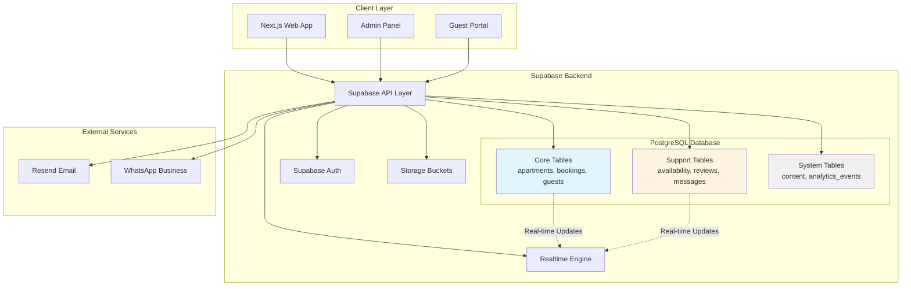
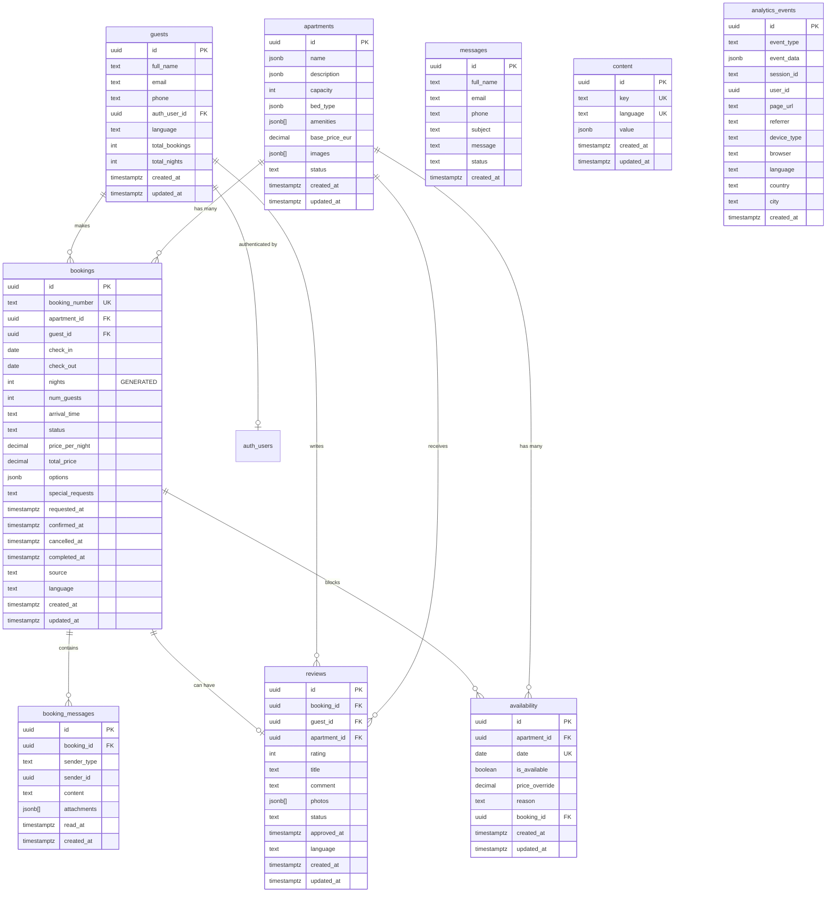
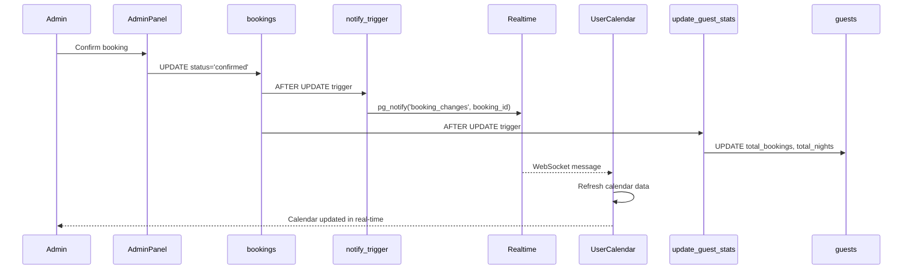
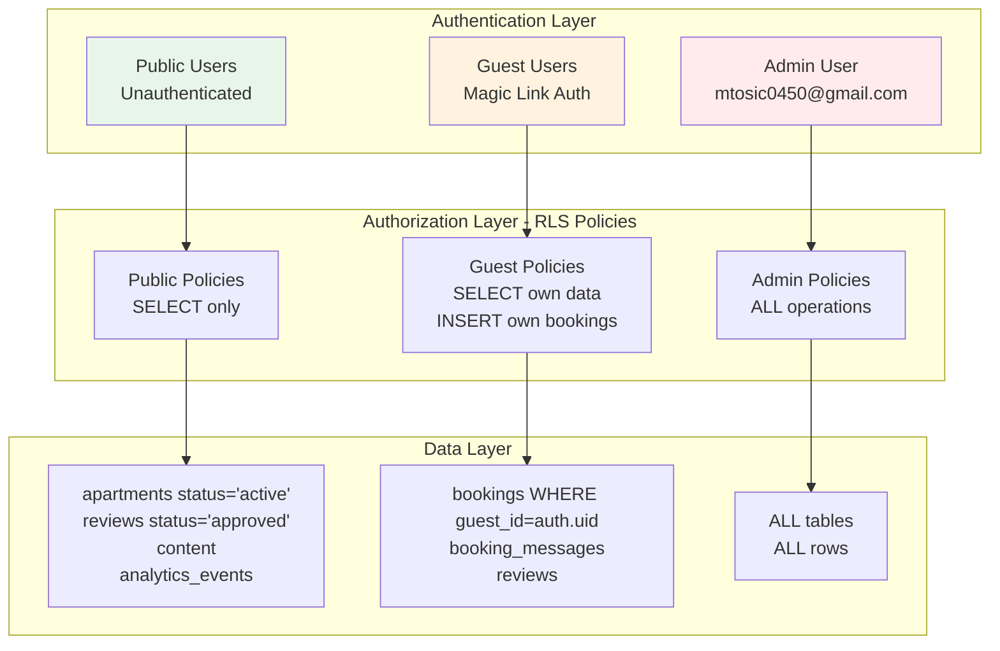

# Design Document: Complete Supabase Database Schema & SQL Scripts

## Overview

This design document provides a complete, implementation-ready specification for the Supabase PostgreSQL database schema for Apartmani Jovča. The database is designed to support a multi-language booking platform with real-time calendar updates, guest portal authentication, admin management, and custom analytics tracking.

The design delivers 6 executable SQL scripts that create a production-ready database from scratch:

1. **00_DROP_ALL_FRESH_START.sql** - Clean slate for development
2. **01_SCHEMA_COMPLETE.sql** - All 9 tables with indexes and constraints
3. **02_RLS_POLICIES_COMPLETE.sql** - Row Level Security policies
4. **03_FUNCTIONS_COMPLETE.sql** - 5 database functions + 2 triggers
5. **04_REALTIME_COMPLETE.sql** - Real-time subscriptions + availability view
6. **05_SEED_DATA_COMPLETE.sql** - Initial data for 4 apartments

The database schema is optimized for:
- **Zero double-bookings** via PostgreSQL daterange exclusion constraints
- **Multi-language content** using JSONB columns (Serbian, English, German, Italian)
- **Real-time updates** via Supabase WebSocket subscriptions
- **Database-level security** via Row Level Security (RLS) policies
- **High performance** via strategic indexes on frequently queried columns
- **ACID compliance** for booking transactions

## Architecture

### System Architecture



### Database Entity-Relationship Diagram



### Data Flow Diagrams

#### Booking Creation Flow

```mermaid
sequenceDiagram
    participant User
    participant NextJS
    participant check_availability()
    participant bookings
    participant availability
    participant notify_trigger
    participant Realtime
    participant Email
    
    User->>NextJS: Submit booking request
    NextJS->>check_availability(): Check dates available?
    check_availability()-->>NextJS: TRUE
    
    NextJS->>bookings: BEGIN TRANSACTION
    NextJS->>bookings: INSERT booking (status: pending)
    bookings->>notify_trigger: AFTER INSERT trigger
    notify_trigger->>Realtime: pg_notify('booking_changes')
    
    NextJS->>availability: UPDATE dates (is_available: false)
    NextJS->>bookings: COMMIT TRANSACTION
    
    bookings-->>NextJS: Booking created
    NextJS->>Email: Send confirmation email
    NextJS-->>User: Show confirmation page
    
    Realtime-->>User: Calendar updates (WebSocket)
    
    Note over bookings,availability: Exclusion constraint prevents overlaps
```

#### Availability Check Flow

```mermaid
sequenceDiagram
    participant User
    participant Calendar
    participant get_available_apartments()
    participant check_availability()
    participant apartments
    participant bookings
    
    User->>Calendar: Select dates + num_guests
    Calendar->>get_available_apartments(): Query(check_in, check_out, num_guests)
    
    get_available_apartments()->>apartments: SELECT WHERE status='active' AND capacity>=num_guests
    
    loop For each apartment
        get_available_apartments()->>check_availability(): Check apartment availability
        check_availability()->>bookings: Check for overlapping bookings
        bookings-->>check_availability(): No overlaps found
        check_availability()-->>get_available_apartments(): TRUE
    end
    
    get_available_apartments()-->>Calendar: List of available apartments
    Calendar-->>User: Display available options
```

#### Real-Time Update Flow



### Security Architecture




## Components and Interfaces

### Core Database Tables

#### 1. apartments

**Purpose:** Store apartment information with multi-language content

**Columns:**
- `id` (UUID, PK) - Unique identifier
- `name` (JSONB) - Multi-language names: `{"sr": "Apartman Deluxe", "en": "Deluxe Apartment", "de": "Deluxe Wohnung", "it": "Appartamento Deluxe"}`
- `description` (JSONB) - Multi-language descriptions
- `capacity` (INT) - Maximum number of guests
- `bed_type` (JSONB) - Bed configuration: `{"sr": "1 bračni krevet + 1 kauč", "en": "1 double bed + 1 sofa bed", ...}`
- `amenities` (JSONB[]) - Array of amenity codes: `["wifi", "parking", "lake_view", "kitchen", "air_conditioning"]`
- `base_price_eur` (DECIMAL(10,2)) - Base nightly rate in EUR
- `images` (JSONB[]) - Array of image objects: `[{"url": "...", "alt": "...", "order": 1}, ...]`
- `status` (TEXT) - 'active', 'inactive', 'maintenance'
- `created_at` (TIMESTAMPTZ) - Record creation timestamp
- `updated_at` (TIMESTAMPTZ) - Last update timestamp

**Indexes:**
- Primary key on `id`
- Index on `status` for filtering active apartments

**Constraints:**
- `capacity` must be > 0
- `base_price_eur` must be > 0
- `status` must be one of: 'active', 'inactive', 'maintenance'

#### 2. bookings

**Purpose:** Store booking records with date ranges and prevent overlaps

**Columns:**
- `id` (UUID, PK) - Unique identifier
- `booking_number` (TEXT, UNIQUE) - Human-readable booking reference: "BJ-2024-0123"
- `apartment_id` (UUID, FK → apartments.id) - Reference to apartment
- `guest_id` (UUID, FK → guests.id) - Reference to guest
- `check_in` (DATE) - Check-in date
- `check_out` (DATE) - Check-out date
- `nights` (INT, GENERATED) - Calculated as `(check_out - check_in)` STORED
- `num_guests` (INT) - Number of guests
- `arrival_time` (TEXT) - Expected arrival time slot: "14-16h", "16-18h", "18-20h"
- `status` (TEXT) - 'pending', 'confirmed', 'cancelled', 'completed'
- `price_per_night` (DECIMAL(10,2)) - Nightly rate at time of booking
- `total_price` (DECIMAL(10,2)) - Total booking price
- `options` (JSONB) - Additional options: `["crib", "early_checkin", "late_checkout"]`
- `special_requests` (TEXT) - Guest special requests
- `requested_at` (TIMESTAMPTZ) - When booking was requested
- `confirmed_at` (TIMESTAMPTZ) - When booking was confirmed
- `cancelled_at` (TIMESTAMPTZ) - When booking was cancelled
- `completed_at` (TIMESTAMPTZ) - When guest checked out
- `source` (TEXT) - 'website', 'phone', 'email', 'booking_com'
- `language` (TEXT) - Guest's preferred language: 'sr', 'en', 'de', 'it'
- `created_at` (TIMESTAMPTZ) - Record creation timestamp
- `updated_at` (TIMESTAMPTZ) - Last update timestamp

**Indexes:**
- Primary key on `id`
- Unique index on `booking_number`
- Index on `apartment_id` for apartment bookings lookup
- Index on `guest_id` for guest bookings lookup
- Index on `(check_in, check_out)` for date range queries
- Index on `status` for filtering by booking status
- **Exclusion constraint** on `(apartment_id, daterange(check_in, check_out, '[]'))` WHERE status IN ('confirmed', 'pending')

**Constraints:**
- `check_out` must be > `check_in`
- `num_guests` must be > 0
- `price_per_night` must be > 0
- `total_price` must be > 0
- `status` must be one of: 'pending', 'confirmed', 'cancelled', 'completed'
- Foreign key to `apartments(id)` ON DELETE RESTRICT
- Foreign key to `guests(id)` ON DELETE RESTRICT

**Critical Feature:** The exclusion constraint using PostgreSQL's `daterange` type prevents any two bookings with status 'confirmed' or 'pending' from overlapping for the same apartment. This guarantees zero double-bookings at the database level.

#### 3. guests

**Purpose:** Store guest information and authentication references

**Columns:**
- `id` (UUID, PK) - Unique identifier
- `full_name` (TEXT) - Guest's full name
- `email` (TEXT) - Guest's email address
- `phone` (TEXT) - Guest's phone number
- `auth_user_id` (UUID, FK → auth.users.id) - Reference to Supabase auth user (nullable for guests who haven't registered)
- `language` (TEXT) - Preferred language: 'sr', 'en', 'de', 'it'
- `total_bookings` (INT) - Total number of confirmed bookings (updated by trigger)
- `total_nights` (INT) - Total nights stayed (updated by trigger)
- `created_at` (TIMESTAMPTZ) - Record creation timestamp
- `updated_at` (TIMESTAMPTZ) - Last update timestamp

**Indexes:**
- Primary key on `id`
- Index on `email` for guest lookup
- Index on `auth_user_id` for authentication lookup

**Constraints:**
- `email` must be valid email format
- `total_bookings` must be >= 0
- `total_nights` must be >= 0
- Foreign key to `auth.users(id)` ON DELETE SET NULL

#### 4. availability

**Purpose:** Track per-date availability and pricing overrides

**Columns:**
- `id` (UUID, PK) - Unique identifier
- `apartment_id` (UUID, FK → apartments.id) - Reference to apartment
- `date` (DATE) - Specific date
- `is_available` (BOOLEAN) - Whether apartment is available on this date
- `price_override` (DECIMAL(10,2)) - Override base price for this date (nullable)
- `reason` (TEXT) - Reason for unavailability: 'booked', 'maintenance', 'blocked'
- `booking_id` (UUID, FK → bookings.id) - Reference to booking if reason is 'booked'
- `created_at` (TIMESTAMPTZ) - Record creation timestamp
- `updated_at` (TIMESTAMPTZ) - Last update timestamp

**Indexes:**
- Primary key on `id`
- Unique index on `(apartment_id, date)` - One record per apartment per date
- Index on `(apartment_id, date)` for calendar queries
- Index on `date` for date-based queries

**Constraints:**
- Unique constraint on `(apartment_id, date)`
- Foreign key to `apartments(id)` ON DELETE CASCADE
- Foreign key to `bookings(id)` ON DELETE SET NULL

#### 5. reviews

**Purpose:** Store guest reviews with approval workflow

**Columns:**
- `id` (UUID, PK) - Unique identifier
- `booking_id` (UUID, FK → bookings.id) - Reference to booking
- `guest_id` (UUID, FK → guests.id) - Reference to guest
- `apartment_id` (UUID, FK → apartments.id) - Reference to apartment
- `rating` (INT) - Rating from 1 to 5
- `title` (TEXT) - Review title
- `comment` (TEXT) - Review text
- `photos` (JSONB[]) - Guest-uploaded photos: `[{"url": "...", "caption": "..."}, ...]`
- `status` (TEXT) - 'pending', 'approved', 'rejected'
- `approved_at` (TIMESTAMPTZ) - When review was approved
- `language` (TEXT) - Review language: 'sr', 'en', 'de', 'it'
- `created_at` (TIMESTAMPTZ) - Record creation timestamp
- `updated_at` (TIMESTAMPTZ) - Last update timestamp

**Indexes:**
- Primary key on `id`
- Index on `apartment_id` for apartment reviews lookup
- Index on `status` for filtering approved reviews
- Index on `rating` for rating-based queries

**Constraints:**
- `rating` must be between 1 and 5
- `status` must be one of: 'pending', 'approved', 'rejected'
- Foreign key to `bookings(id)` ON DELETE CASCADE
- Foreign key to `guests(id)` ON DELETE CASCADE
- Foreign key to `apartments(id)` ON DELETE CASCADE

#### 6. booking_messages

**Purpose:** Store guest-admin communication within guest portal

**Columns:**
- `id` (UUID, PK) - Unique identifier
- `booking_id` (UUID, FK → bookings.id) - Reference to booking
- `sender_type` (TEXT) - 'guest' or 'admin'
- `sender_id` (UUID) - guest_id or admin user_id
- `content` (TEXT) - Message text
- `attachments` (JSONB[]) - File attachments: `[{"url": "...", "type": "image", "name": "..."}, ...]`
- `read_at` (TIMESTAMPTZ) - When message was read (nullable)
- `created_at` (TIMESTAMPTZ) - Message timestamp

**Indexes:**
- Primary key on `id`
- Index on `booking_id` for booking messages lookup
- Index on `created_at DESC` for chronological ordering

**Constraints:**
- `sender_type` must be one of: 'guest', 'admin'
- Foreign key to `bookings(id)` ON DELETE CASCADE

#### 7. messages

**Purpose:** Store contact form submissions from public website

**Columns:**
- `id` (UUID, PK) - Unique identifier
- `full_name` (TEXT) - Sender's name
- `email` (TEXT) - Sender's email
- `phone` (TEXT) - Sender's phone (optional)
- `subject` (TEXT) - Message subject
- `message` (TEXT) - Message content
- `status` (TEXT) - 'new', 'read', 'replied', 'archived'
- `created_at` (TIMESTAMPTZ) - Message timestamp

**Indexes:**
- Primary key on `id`
- Index on `status` for filtering messages
- Index on `created_at DESC` for chronological ordering

**Constraints:**
- `email` must be valid email format
- `status` must be one of: 'new', 'read', 'replied', 'archived'

#### 8. content

**Purpose:** Multi-language CMS content with key-value structure

**Columns:**
- `id` (UUID, PK) - Unique identifier
- `key` (TEXT) - Content key: 'home.hero.title', 'prices.description', etc.
- `language` (TEXT) - Language code: 'sr', 'en', 'de', 'it'
- `value` (JSONB) - Content value (flexible: text, rich text, arrays, objects)
- `created_at` (TIMESTAMPTZ) - Record creation timestamp
- `updated_at` (TIMESTAMPTZ) - Last update timestamp

**Indexes:**
- Primary key on `id`
- Unique index on `(key, language)` - One value per key per language
- Index on `(key, language)` for content lookup

**Constraints:**
- Unique constraint on `(key, language)`
- `language` must be one of: 'sr', 'en', 'de', 'it'

#### 9. analytics_events

**Purpose:** Custom analytics tracking for booking funnel and user behavior

**Columns:**
- `id` (UUID, PK) - Unique identifier
- `event_type` (TEXT) - Event type: 'page_view', 'booking_step', 'cta_click', etc.
- `event_data` (JSONB) - Event-specific data: `{"step": 1, "apartment_id": "..."}`
- `session_id` (TEXT) - Session identifier
- `user_id` (UUID) - User ID if authenticated (nullable)
- `page_url` (TEXT) - Page URL where event occurred
- `referrer` (TEXT) - HTTP referrer
- `device_type` (TEXT) - 'mobile', 'tablet', 'desktop'
- `browser` (TEXT) - Browser name
- `language` (TEXT) - Browser language
- `country` (TEXT) - Country code (from Vercel edge)
- `city` (TEXT) - City name (from Vercel edge)
- `created_at` (TIMESTAMPTZ) - Event timestamp

**Indexes:**
- Primary key on `id`
- Index on `event_type` for event filtering
- Index on `created_at DESC` for time-series queries
- Index on `session_id` for session analysis

**Constraints:**
- None (flexible schema for analytics)

### Database Functions

#### 1. check_availability()

**Purpose:** Check if an apartment is available for a date range

**Signature:**
```sql
check_availability(
  p_apartment_id UUID,
  p_check_in DATE,
  p_check_out DATE
) RETURNS BOOLEAN
```

**Logic:**
- Returns FALSE if any booking with status 'confirmed' or 'pending' overlaps the date range
- Returns TRUE if no overlapping bookings exist
- Uses PostgreSQL `daterange` overlap operator `&&` for efficient comparison

**Performance:** O(log n) with index on `(apartment_id, check_in, check_out)`

#### 2. get_available_apartments()

**Purpose:** Get list of available apartments for given dates and guest count

**Signature:**
```sql
get_available_apartments(
  p_check_in DATE,
  p_check_out DATE,
  p_num_guests INT
) RETURNS TABLE (
  apartment_id UUID,
  name JSONB,
  price DECIMAL
)
```

**Logic:**
1. Filter apartments WHERE status = 'active'
2. Filter apartments WHERE capacity >= p_num_guests
3. For each apartment, call `check_availability()`
4. Return only apartments that pass all filters

**Performance:** O(n * log m) where n = number of apartments, m = number of bookings

#### 3. get_admin_stats()

**Purpose:** Calculate dashboard statistics for admin panel

**Signature:**
```sql
get_admin_stats() RETURNS JSONB
```

**Returns:**
```json
{
  "total_bookings": 123,
  "confirmed_bookings": 98,
  "pending_bookings": 15,
  "cancelled_bookings": 10,
  "total_revenue": 45678.50,
  "total_guests": 87,
  "avg_rating": 4.8
}
```

**Logic:**
- Aggregate counts from `bookings` table grouped by status
- Sum `total_price` from bookings WHERE status = 'confirmed'
- Count distinct guests from `guests` table
- Calculate average rating from `reviews` WHERE status = 'approved'

**Performance:** O(n) with indexes on status columns

#### 4. notify_booking_change() (Trigger Function)

**Purpose:** Send real-time notification when booking changes

**Trigger:** AFTER INSERT OR UPDATE OR DELETE ON bookings

**Logic:**
```sql
PERFORM pg_notify(
  'booking_changes',
  json_build_object(
    'operation', TG_OP,
    'booking_id', COALESCE(NEW.id, OLD.id),
    'apartment_id', COALESCE(NEW.apartment_id, OLD.apartment_id)
  )::text
);
```

**Effect:** Connected clients subscribed to 'booking_changes' channel receive WebSocket notification

#### 5. update_guest_stats() (Trigger Function)

**Purpose:** Automatically update guest statistics when booking status changes

**Trigger:** AFTER INSERT OR UPDATE ON bookings

**Logic:**
- When booking status changes to 'confirmed':
  - Increment `guests.total_bookings` by 1
  - Increment `guests.total_nights` by `booking.nights`
- When booking status changes from 'confirmed' to 'cancelled':
  - Decrement `guests.total_bookings` by 1
  - Decrement `guests.total_nights` by `booking.nights`

**Performance:** O(1) with index on `guests.id`

### Database Views

#### availability_view

**Purpose:** Denormalized view for efficient calendar queries

**Definition:**
```sql
CREATE VIEW availability_view AS
SELECT
  a.id AS apartment_id,
  a.name AS apartment_name,
  av.date,
  av.is_available,
  av.price_override,
  a.base_price_eur,
  COALESCE(av.price_override, a.base_price_eur) AS effective_price,
  av.reason,
  av.booking_id
FROM apartments a
CROSS JOIN generate_series(
  CURRENT_DATE,
  CURRENT_DATE + INTERVAL '365 days',
  INTERVAL '1 day'
)::date AS dates(date)
LEFT JOIN availability av ON av.apartment_id = a.id AND av.date = dates.date
WHERE a.status = 'active';
```

**Columns:**
- `apartment_id` - Apartment UUID
- `apartment_name` - Multi-language apartment name (JSONB)
- `date` - Specific date
- `is_available` - Availability flag
- `price_override` - Override price (nullable)
- `base_price_eur` - Base price from apartments table
- `effective_price` - Calculated price (override or base)
- `reason` - Unavailability reason
- `booking_id` - Reference to booking if booked

**Usage:** Frontend calendar queries can fetch 30-90 days of data with apartment details in a single query

### Real-Time Subscriptions

**Enabled Tables:**
- `bookings` - Real-time booking updates
- `apartments` - Real-time apartment changes
- `availability` - Real-time calendar updates
- `booking_messages` - Real-time chat messages
- `analytics_events` - Real-time analytics tracking

**Configuration:**
```sql
ALTER PUBLICATION supabase_realtime ADD TABLE bookings;
ALTER PUBLICATION supabase_realtime ADD TABLE apartments;
ALTER PUBLICATION supabase_realtime ADD TABLE availability;
ALTER PUBLICATION supabase_realtime ADD TABLE booking_messages;
ALTER PUBLICATION supabase_realtime ADD TABLE analytics_events;
```

**Client Subscription Example:**
```typescript
const subscription = supabase
  .channel('availability-changes')
  .on('postgres_changes', {
    event: '*',
    schema: 'public',
    table: 'availability'
  }, (payload) => {
    // Update calendar UI
    console.log('Availability changed:', payload)
  })
  .subscribe()
```


## Data Models

### Complete SQL DDL

#### Script 00: DROP ALL (Fresh Start)

**File:** `00_DROP_ALL_FRESH_START.sql`

```sql
-- =====================================================
-- 00_DROP_ALL_FRESH_START.sql
-- Drop all database objects for fresh start
-- WARNING: This will delete ALL data
-- =====================================================

-- Drop views
DROP VIEW IF EXISTS availability_view CASCADE;

-- Drop triggers
DROP TRIGGER IF EXISTS notify_booking_change_trigger ON bookings CASCADE;
DROP TRIGGER IF EXISTS update_guest_stats_trigger ON bookings CASCADE;

-- Drop functions
DROP FUNCTION IF EXISTS notify_booking_change() CASCADE;
DROP FUNCTION IF EXISTS update_guest_stats() CASCADE;
DROP FUNCTION IF EXISTS check_availability(UUID, DATE, DATE) CASCADE;
DROP FUNCTION IF EXISTS get_available_apartments(DATE, DATE, INT) CASCADE;
DROP FUNCTION IF EXISTS get_admin_stats() CASCADE;

-- Drop tables in reverse dependency order
DROP TABLE IF EXISTS analytics_events CASCADE;
DROP TABLE IF EXISTS content CASCADE;
DROP TABLE IF EXISTS messages CASCADE;
DROP TABLE IF EXISTS booking_messages CASCADE;
DROP TABLE IF EXISTS reviews CASCADE;
DROP TABLE IF EXISTS availability CASCADE;
DROP TABLE IF EXISTS bookings CASCADE;
DROP TABLE IF EXISTS guests CASCADE;
DROP TABLE IF EXISTS apartments CASCADE;

-- Note: auth.users is managed by Supabase, do not drop
```

#### Script 01: Complete Schema

**File:** `01_SCHEMA_COMPLETE.sql`

```sql
-- =====================================================
-- 01_SCHEMA_COMPLETE.sql
-- Complete database schema with all tables, indexes, and constraints
-- =====================================================

-- Enable required extensions
CREATE EXTENSION IF NOT EXISTS "uuid-ossp";
CREATE EXTENSION IF NOT EXISTS "btree_gist"; -- Required for exclusion constraints

-- =====================================================
-- TABLE: apartments
-- =====================================================
CREATE TABLE apartments (
  id UUID PRIMARY KEY DEFAULT uuid_generate_v4(),
  
  -- Multi-language content
  name JSONB NOT NULL,
  description JSONB NOT NULL,
  bed_type JSONB NOT NULL,
  
  -- Capacity and amenities
  capacity INT NOT NULL CHECK (capacity > 0),
  amenities JSONB[] DEFAULT '{}',
  
  -- Pricing
  base_price_eur DECIMAL(10,2) NOT NULL CHECK (base_price_eur > 0),
  
  -- Images
  images JSONB[] DEFAULT '{}',
  
  -- Status
  status TEXT NOT NULL DEFAULT 'active' CHECK (status IN ('active', 'inactive', 'maintenance')),
  
  -- Timestamps
  created_at TIMESTAMPTZ NOT NULL DEFAULT NOW(),
  updated_at TIMESTAMPTZ NOT NULL DEFAULT NOW()
);

-- Indexes for apartments
CREATE INDEX idx_apartments_status ON apartments(status);

-- Comments for apartments
COMMENT ON TABLE apartments IS 'Apartment listings with multi-language content';
COMMENT ON COLUMN apartments.name IS 'Multi-language names: {"sr": "...", "en": "...", "de": "...", "it": "..."}';
COMMENT ON COLUMN apartments.amenities IS 'Array of amenity codes: ["wifi", "parking", "lake_view", ...]';

-- =====================================================
-- TABLE: guests
-- =====================================================
CREATE TABLE guests (
  id UUID PRIMARY KEY DEFAULT uuid_generate_v4(),
  
  -- Contact information
  full_name TEXT NOT NULL,
  email TEXT NOT NULL,
  phone TEXT NOT NULL,
  
  -- Authentication reference
  auth_user_id UUID REFERENCES auth.users(id) ON DELETE SET NULL,
  
  -- Preferences
  language TEXT NOT NULL DEFAULT 'sr' CHECK (language IN ('sr', 'en', 'de', 'it')),
  
  -- Statistics (updated by triggers)
  total_bookings INT NOT NULL DEFAULT 0 CHECK (total_bookings >= 0),
  total_nights INT NOT NULL DEFAULT 0 CHECK (total_nights >= 0),
  
  -- Timestamps
  created_at TIMESTAMPTZ NOT NULL DEFAULT NOW(),
  updated_at TIMESTAMPTZ NOT NULL DEFAULT NOW()
);

-- Indexes for guests
CREATE INDEX idx_guests_email ON guests(email);
CREATE INDEX idx_guests_auth_user_id ON guests(auth_user_id);

-- Comments for guests
COMMENT ON TABLE guests IS 'Guest information and authentication references';
COMMENT ON COLUMN guests.auth_user_id IS 'Reference to Supabase auth.users for guest portal access';
COMMENT ON COLUMN guests.total_bookings IS 'Total confirmed bookings (updated by trigger)';
COMMENT ON COLUMN guests.total_nights IS 'Total nights stayed (updated by trigger)';

-- =====================================================
-- TABLE: bookings
-- =====================================================
CREATE TABLE bookings (
  id UUID PRIMARY KEY DEFAULT uuid_generate_v4(),
  
  -- Booking reference
  booking_number TEXT NOT NULL UNIQUE,
  
  -- Foreign keys
  apartment_id UUID NOT NULL REFERENCES apartments(id) ON DELETE RESTRICT,
  guest_id UUID NOT NULL REFERENCES guests(id) ON DELETE RESTRICT,
  
  -- Dates
  check_in DATE NOT NULL,
  check_out DATE NOT NULL,
  nights INT GENERATED ALWAYS AS (check_out - check_in) STORED,
  
  -- Guest details
  num_guests INT NOT NULL CHECK (num_guests > 0),
  arrival_time TEXT,
  
  -- Status
  status TEXT NOT NULL DEFAULT 'pending' CHECK (status IN ('pending', 'confirmed', 'cancelled', 'completed')),
  
  -- Pricing
  price_per_night DECIMAL(10,2) NOT NULL CHECK (price_per_night > 0),
  total_price DECIMAL(10,2) NOT NULL CHECK (total_price > 0),
  
  -- Additional options
  options JSONB DEFAULT '[]',
  special_requests TEXT,
  
  -- Status timestamps
  requested_at TIMESTAMPTZ NOT NULL DEFAULT NOW(),
  confirmed_at TIMESTAMPTZ,
  cancelled_at TIMESTAMPTZ,
  completed_at TIMESTAMPTZ,
  
  -- Metadata
  source TEXT NOT NULL DEFAULT 'website' CHECK (source IN ('website', 'phone', 'email', 'booking_com')),
  language TEXT NOT NULL DEFAULT 'sr' CHECK (language IN ('sr', 'en', 'de', 'it')),
  
  -- Timestamps
  created_at TIMESTAMPTZ NOT NULL DEFAULT NOW(),
  updated_at TIMESTAMPTZ NOT NULL DEFAULT NOW(),
  
  -- Constraints
  CHECK (check_out > check_in)
);

-- Indexes for bookings
CREATE INDEX idx_bookings_apartment_id ON bookings(apartment_id);
CREATE INDEX idx_bookings_guest_id ON bookings(guest_id);
CREATE INDEX idx_bookings_dates ON bookings(check_in, check_out);
CREATE INDEX idx_bookings_status ON bookings(status);
CREATE INDEX idx_bookings_booking_number ON bookings(booking_number);

-- CRITICAL: Exclusion constraint to prevent overlapping bookings
-- This ensures zero double-bookings at the database level
CREATE UNIQUE INDEX idx_bookings_no_overlap 
  ON bookings USING GIST (
    apartment_id WITH =,
    daterange(check_in, check_out, '[]') WITH &&
  )
  WHERE status IN ('confirmed', 'pending');

-- Comments for bookings
COMMENT ON TABLE bookings IS 'Booking records with overlap prevention';
COMMENT ON COLUMN bookings.booking_number IS 'Human-readable reference: BJ-2024-0123';
COMMENT ON COLUMN bookings.nights IS 'Calculated as (check_out - check_in), stored for performance';
COMMENT ON COLUMN bookings.options IS 'Additional options: ["crib", "early_checkin", "late_checkout"]';
COMMENT ON INDEX idx_bookings_no_overlap IS 'CRITICAL: Prevents overlapping bookings for same apartment';

-- =====================================================
-- TABLE: availability
-- =====================================================
CREATE TABLE availability (
  id UUID PRIMARY KEY DEFAULT uuid_generate_v4(),
  
  -- Foreign keys
  apartment_id UUID NOT NULL REFERENCES apartments(id) ON DELETE CASCADE,
  
  -- Date
  date DATE NOT NULL,
  
  -- Availability
  is_available BOOLEAN NOT NULL DEFAULT TRUE,
  price_override DECIMAL(10,2) CHECK (price_override IS NULL OR price_override > 0),
  
  -- Reason for unavailability
  reason TEXT CHECK (reason IS NULL OR reason IN ('booked', 'maintenance', 'blocked')),
  booking_id UUID REFERENCES bookings(id) ON DELETE SET NULL,
  
  -- Timestamps
  created_at TIMESTAMPTZ NOT NULL DEFAULT NOW(),
  updated_at TIMESTAMPTZ NOT NULL DEFAULT NOW(),
  
  -- Unique constraint: one record per apartment per date
  UNIQUE(apartment_id, date)
);

-- Indexes for availability
CREATE INDEX idx_availability_apartment_date ON availability(apartment_id, date);
CREATE INDEX idx_availability_date ON availability(date);

-- Comments for availability
COMMENT ON TABLE availability IS 'Per-date availability tracking with price overrides';
COMMENT ON COLUMN availability.price_override IS 'Override base price for specific dates (e.g., holidays)';
COMMENT ON COLUMN availability.reason IS 'Why unavailable: booked, maintenance, or manually blocked';

-- =====================================================
-- TABLE: reviews
-- =====================================================
CREATE TABLE reviews (
  id UUID PRIMARY KEY DEFAULT uuid_generate_v4(),
  
  -- Foreign keys
  booking_id UUID NOT NULL REFERENCES bookings(id) ON DELETE CASCADE,
  guest_id UUID NOT NULL REFERENCES guests(id) ON DELETE CASCADE,
  apartment_id UUID NOT NULL REFERENCES apartments(id) ON DELETE CASCADE,
  
  -- Rating
  rating INT NOT NULL CHECK (rating >= 1 AND rating <= 5),
  
  -- Review content
  title TEXT,
  comment TEXT,
  
  -- Guest photos
  photos JSONB[] DEFAULT '{}',
  
  -- Approval workflow
  status TEXT NOT NULL DEFAULT 'pending' CHECK (status IN ('pending', 'approved', 'rejected')),
  approved_at TIMESTAMPTZ,
  
  -- Metadata
  language TEXT NOT NULL DEFAULT 'sr' CHECK (language IN ('sr', 'en', 'de', 'it')),
  
  -- Timestamps
  created_at TIMESTAMPTZ NOT NULL DEFAULT NOW(),
  updated_at TIMESTAMPTZ NOT NULL DEFAULT NOW()
);

-- Indexes for reviews
CREATE INDEX idx_reviews_apartment_id ON reviews(apartment_id);
CREATE INDEX idx_reviews_status ON reviews(status);
CREATE INDEX idx_reviews_rating ON reviews(rating);

-- Comments for reviews
COMMENT ON TABLE reviews IS 'Guest reviews with approval workflow';
COMMENT ON COLUMN reviews.photos IS 'Guest-uploaded photos: [{"url": "...", "caption": "..."}, ...]';
COMMENT ON COLUMN reviews.status IS 'Approval status: pending, approved, or rejected';

-- =====================================================
-- TABLE: booking_messages
-- =====================================================
CREATE TABLE booking_messages (
  id UUID PRIMARY KEY DEFAULT uuid_generate_v4(),
  
  -- Foreign keys
  booking_id UUID NOT NULL REFERENCES bookings(id) ON DELETE CASCADE,
  
  -- Sender information
  sender_type TEXT NOT NULL CHECK (sender_type IN ('guest', 'admin')),
  sender_id UUID NOT NULL,
  
  -- Message content
  content TEXT NOT NULL,
  attachments JSONB[] DEFAULT '{}',
  
  -- Read status
  read_at TIMESTAMPTZ,
  
  -- Timestamp
  created_at TIMESTAMPTZ NOT NULL DEFAULT NOW()
);

-- Indexes for booking_messages
CREATE INDEX idx_booking_messages_booking_id ON booking_messages(booking_id);
CREATE INDEX idx_booking_messages_created_at ON booking_messages(created_at DESC);

-- Comments for booking_messages
COMMENT ON TABLE booking_messages IS 'Guest-admin communication within guest portal';
COMMENT ON COLUMN booking_messages.attachments IS 'File attachments: [{"url": "...", "type": "image", "name": "..."}, ...]';

-- =====================================================
-- TABLE: messages
-- =====================================================
CREATE TABLE messages (
  id UUID PRIMARY KEY DEFAULT uuid_generate_v4(),
  
  -- Contact information
  full_name TEXT NOT NULL,
  email TEXT NOT NULL,
  phone TEXT,
  
  -- Message content
  subject TEXT NOT NULL,
  message TEXT NOT NULL,
  
  -- Status
  status TEXT NOT NULL DEFAULT 'new' CHECK (status IN ('new', 'read', 'replied', 'archived')),
  
  -- Timestamp
  created_at TIMESTAMPTZ NOT NULL DEFAULT NOW()
);

-- Indexes for messages
CREATE INDEX idx_messages_status ON messages(status);
CREATE INDEX idx_messages_created_at ON messages(created_at DESC);

-- Comments for messages
COMMENT ON TABLE messages IS 'Contact form submissions from public website';

-- =====================================================
-- TABLE: content
-- =====================================================
CREATE TABLE content (
  id UUID PRIMARY KEY DEFAULT uuid_generate_v4(),
  
  -- Content key-value
  key TEXT NOT NULL,
  language TEXT NOT NULL CHECK (language IN ('sr', 'en', 'de', 'it')),
  value JSONB NOT NULL,
  
  -- Timestamps
  created_at TIMESTAMPTZ NOT NULL DEFAULT NOW(),
  updated_at TIMESTAMPTZ NOT NULL DEFAULT NOW(),
  
  -- Unique constraint: one value per key per language
  UNIQUE(key, language)
);

-- Indexes for content
CREATE INDEX idx_content_key_language ON content(key, language);

-- Comments for content
COMMENT ON TABLE content IS 'Multi-language CMS content with key-value structure';
COMMENT ON COLUMN content.key IS 'Content key: home.hero.title, prices.description, etc.';
COMMENT ON COLUMN content.value IS 'Flexible JSONB value: text, rich text, arrays, objects';

-- =====================================================
-- TABLE: analytics_events
-- =====================================================
CREATE TABLE analytics_events (
  id UUID PRIMARY KEY DEFAULT uuid_generate_v4(),
  
  -- Event information
  event_type TEXT NOT NULL,
  event_data JSONB,
  
  -- Session information
  session_id TEXT,
  user_id UUID,
  
  -- Context
  page_url TEXT,
  referrer TEXT,
  device_type TEXT CHECK (device_type IS NULL OR device_type IN ('mobile', 'tablet', 'desktop')),
  browser TEXT,
  language TEXT,
  
  -- Geo information (from Vercel edge)
  country TEXT,
  city TEXT,
  
  -- Timestamp
  created_at TIMESTAMPTZ NOT NULL DEFAULT NOW()
);

-- Indexes for analytics_events
CREATE INDEX idx_analytics_events_event_type ON analytics_events(event_type);
CREATE INDEX idx_analytics_events_created_at ON analytics_events(created_at DESC);
CREATE INDEX idx_analytics_events_session_id ON analytics_events(session_id);

-- Comments for analytics_events
COMMENT ON TABLE analytics_events IS 'Custom analytics tracking for booking funnel and user behavior';
COMMENT ON COLUMN analytics_events.event_type IS 'Event type: page_view, booking_step, cta_click, etc.';
COMMENT ON COLUMN analytics_events.event_data IS 'Event-specific data: {"step": 1, "apartment_id": "..."}';
```

#### Script 02: Row Level Security Policies

**File:** `02_RLS_POLICIES_COMPLETE.sql`

```sql
-- =====================================================
-- 02_RLS_POLICIES_COMPLETE.sql
-- Row Level Security policies for all tables
-- =====================================================

-- =====================================================
-- RLS: apartments
-- =====================================================
ALTER TABLE apartments ENABLE ROW LEVEL SECURITY;

-- Public users can view active apartments
CREATE POLICY "Public can view active apartments"
  ON apartments
  FOR SELECT
  USING (status = 'active');

-- Admin can manage all apartments
CREATE POLICY "Admin can manage apartments"
  ON apartments
  FOR ALL
  USING (auth.jwt() ->> 'email' = 'mtosic0450@gmail.com');

-- =====================================================
-- RLS: guests
-- =====================================================
ALTER TABLE guests ENABLE ROW LEVEL SECURITY;

-- Guests can view their own profile
CREATE POLICY "Guests can view own profile"
  ON guests
  FOR SELECT
  USING (auth.uid() = auth_user_id);

-- Guests can update their own profile
CREATE POLICY "Guests can update own profile"
  ON guests
  FOR UPDATE
  USING (auth.uid() = auth_user_id);

-- Admin can manage all guests
CREATE POLICY "Admin can manage guests"
  ON guests
  FOR ALL
  USING (auth.jwt() ->> 'email' = 'mtosic0450@gmail.com');

-- =====================================================
-- RLS: bookings
-- =====================================================
ALTER TABLE bookings ENABLE ROW LEVEL SECURITY;

-- Guests can view their own bookings
CREATE POLICY "Guests can view own bookings"
  ON bookings
  FOR SELECT
  USING (
    guest_id IN (
      SELECT id FROM guests WHERE auth_user_id = auth.uid()
    )
  );

-- Guests can insert bookings for themselves
CREATE POLICY "Guests can create bookings"
  ON bookings
  FOR INSERT
  WITH CHECK (
    guest_id IN (
      SELECT id FROM guests WHERE auth_user_id = auth.uid()
    )
  );

-- Admin can manage all bookings
CREATE POLICY "Admin can manage bookings"
  ON bookings
  FOR ALL
  USING (auth.jwt() ->> 'email' = 'mtosic0450@gmail.com');

-- =====================================================
-- RLS: availability
-- =====================================================
ALTER TABLE availability ENABLE ROW LEVEL SECURITY;

-- Public users can view availability
CREATE POLICY "Public can view availability"
  ON availability
  FOR SELECT
  USING (TRUE);

-- Admin can manage availability
CREATE POLICY "Admin can manage availability"
  ON availability
  FOR ALL
  USING (auth.jwt() ->> 'email' = 'mtosic0450@gmail.com');

-- =====================================================
-- RLS: reviews
-- =====================================================
ALTER TABLE reviews ENABLE ROW LEVEL SECURITY;

-- Public users can view approved reviews
CREATE POLICY "Public can view approved reviews"
  ON reviews
  FOR SELECT
  USING (status = 'approved');

-- Guests can view their own reviews (any status)
CREATE POLICY "Guests can view own reviews"
  ON reviews
  FOR SELECT
  USING (
    guest_id IN (
      SELECT id FROM guests WHERE auth_user_id = auth.uid()
    )
  );

-- Guests can create reviews for their bookings
CREATE POLICY "Guests can create reviews"
  ON reviews
  FOR INSERT
  WITH CHECK (
    guest_id IN (
      SELECT id FROM guests WHERE auth_user_id = auth.uid()
    )
    AND booking_id IN (
      SELECT b.id FROM bookings b
      JOIN guests g ON g.id = b.guest_id
      WHERE g.auth_user_id = auth.uid()
      AND b.status = 'completed'
    )
  );

-- Admin can manage all reviews
CREATE POLICY "Admin can manage reviews"
  ON reviews
  FOR ALL
  USING (auth.jwt() ->> 'email' = 'mtosic0450@gmail.com');

-- =====================================================
-- RLS: booking_messages
-- =====================================================
ALTER TABLE booking_messages ENABLE ROW LEVEL SECURITY;

-- Guests can view messages for their bookings
CREATE POLICY "Guests can view own booking messages"
  ON booking_messages
  FOR SELECT
  USING (
    booking_id IN (
      SELECT b.id FROM bookings b
      JOIN guests g ON g.id = b.guest_id
      WHERE g.auth_user_id = auth.uid()
    )
  );

-- Guests can send messages for their bookings
CREATE POLICY "Guests can send booking messages"
  ON booking_messages
  FOR INSERT
  WITH CHECK (
    sender_type = 'guest'
    AND booking_id IN (
      SELECT b.id FROM bookings b
      JOIN guests g ON g.id = b.guest_id
      WHERE g.auth_user_id = auth.uid()
    )
  );

-- Admin can manage all booking messages
CREATE POLICY "Admin can manage booking messages"
  ON booking_messages
  FOR ALL
  USING (auth.jwt() ->> 'email' = 'mtosic0450@gmail.com');

-- =====================================================
-- RLS: messages
-- =====================================================
ALTER TABLE messages ENABLE ROW LEVEL SECURITY;

-- Public users can insert contact messages
CREATE POLICY "Public can send contact messages"
  ON messages
  FOR INSERT
  WITH CHECK (TRUE);

-- Admin can manage all messages
CREATE POLICY "Admin can manage messages"
  ON messages
  FOR ALL
  USING (auth.jwt() ->> 'email' = 'mtosic0450@gmail.com');

-- =====================================================
-- RLS: content
-- =====================================================
ALTER TABLE content ENABLE ROW LEVEL SECURITY;

-- Public users can view content
CREATE POLICY "Public can view content"
  ON content
  FOR SELECT
  USING (TRUE);

-- Admin can manage content
CREATE POLICY "Admin can manage content"
  ON content
  FOR ALL
  USING (auth.jwt() ->> 'email' = 'mtosic0450@gmail.com');

-- =====================================================
-- RLS: analytics_events
-- =====================================================
ALTER TABLE analytics_events ENABLE ROW LEVEL SECURITY;

-- Public users can insert analytics events
CREATE POLICY "Public can track analytics"
  ON analytics_events
  FOR INSERT
  WITH CHECK (TRUE);

-- Admin can view all analytics
CREATE POLICY "Admin can view analytics"
  ON analytics_events
  FOR SELECT
  USING (auth.jwt() ->> 'email' = 'mtosic0450@gmail.com');

-- Admin can manage analytics
CREATE POLICY "Admin can manage analytics"
  ON analytics_events
  FOR ALL
  USING (auth.jwt() ->> 'email' = 'mtosic0450@gmail.com');
```


#### Script 03: Database Functions and Triggers

**File:** `03_FUNCTIONS_COMPLETE.sql`

```sql
-- =====================================================
-- 03_FUNCTIONS_COMPLETE.sql
-- Database functions and triggers
-- =====================================================

-- =====================================================
-- FUNCTION: check_availability
-- Check if an apartment is available for a date range
-- =====================================================
CREATE OR REPLACE FUNCTION check_availability(
  p_apartment_id UUID,
  p_check_in DATE,
  p_check_out DATE
)
RETURNS BOOLEAN
LANGUAGE SQL
STABLE
AS $$
  SELECT NOT EXISTS (
    SELECT 1
    FROM bookings
    WHERE apartment_id = p_apartment_id
      AND status IN ('confirmed', 'pending')
      AND daterange(check_in, check_out, '[]') && daterange(p_check_in, p_check_out, '[]')
  );
$$;

COMMENT ON FUNCTION check_availability IS 'Check if apartment is available for date range. Returns TRUE if available, FALSE if any booking overlaps.';

-- =====================================================
-- FUNCTION: get_available_apartments
-- Get list of available apartments for given dates and guest count
-- =====================================================
CREATE OR REPLACE FUNCTION get_available_apartments(
  p_check_in DATE,
  p_check_out DATE,
  p_num_guests INT
)
RETURNS TABLE (
  apartment_id UUID,
  name JSONB,
  description JSONB,
  capacity INT,
  base_price_eur DECIMAL,
  images JSONB[],
  amenities JSONB[]
)
LANGUAGE SQL
STABLE
AS $$
  SELECT
    a.id,
    a.name,
    a.description,
    a.capacity,
    a.base_price_eur,
    a.images,
    a.amenities
  FROM apartments a
  WHERE a.status = 'active'
    AND a.capacity >= p_num_guests
    AND check_availability(a.id, p_check_in, p_check_out) = TRUE
  ORDER BY a.base_price_eur ASC;
$$;

COMMENT ON FUNCTION get_available_apartments IS 'Get available apartments for date range and guest count. Returns apartments sorted by price.';

-- =====================================================
-- FUNCTION: get_admin_stats
-- Calculate dashboard statistics for admin panel
-- =====================================================
CREATE OR REPLACE FUNCTION get_admin_stats()
RETURNS JSONB
LANGUAGE SQL
STABLE
AS $$
  SELECT jsonb_build_object(
    'total_bookings', (
      SELECT COUNT(*) FROM bookings
    ),
    'confirmed_bookings', (
      SELECT COUNT(*) FROM bookings WHERE status = 'confirmed'
    ),
    'pending_bookings', (
      SELECT COUNT(*) FROM bookings WHERE status = 'pending'
    ),
    'cancelled_bookings', (
      SELECT COUNT(*) FROM bookings WHERE status = 'cancelled'
    ),
    'completed_bookings', (
      SELECT COUNT(*) FROM bookings WHERE status = 'completed'
    ),
    'total_revenue', (
      SELECT COALESCE(SUM(total_price), 0) FROM bookings WHERE status = 'confirmed'
    ),
    'total_guests', (
      SELECT COUNT(*) FROM guests
    ),
    'avg_rating', (
      SELECT COALESCE(ROUND(AVG(rating)::numeric, 2), 0) FROM reviews WHERE status = 'approved'
    ),
    'total_reviews', (
      SELECT COUNT(*) FROM reviews WHERE status = 'approved'
    ),
    'pending_reviews', (
      SELECT COUNT(*) FROM reviews WHERE status = 'pending'
    )
  );
$$;

COMMENT ON FUNCTION get_admin_stats IS 'Calculate dashboard statistics. Returns JSONB object with all key metrics.';

-- =====================================================
-- FUNCTION: generate_booking_number
-- Generate unique booking number in format BJ-YYYY-NNNN
-- =====================================================
CREATE OR REPLACE FUNCTION generate_booking_number()
RETURNS TEXT
LANGUAGE PLPGSQL
AS $$
DECLARE
  v_year TEXT;
  v_sequence INT;
  v_booking_number TEXT;
BEGIN
  -- Get current year
  v_year := TO_CHAR(NOW(), 'YYYY');
  
  -- Get next sequence number for this year
  SELECT COALESCE(MAX(
    CAST(SUBSTRING(booking_number FROM 9) AS INT)
  ), 0) + 1
  INTO v_sequence
  FROM bookings
  WHERE booking_number LIKE 'BJ-' || v_year || '-%';
  
  -- Format booking number: BJ-2024-0001
  v_booking_number := 'BJ-' || v_year || '-' || LPAD(v_sequence::TEXT, 4, '0');
  
  RETURN v_booking_number;
END;
$$;

COMMENT ON FUNCTION generate_booking_number IS 'Generate unique booking number in format BJ-YYYY-NNNN';

-- =====================================================
-- FUNCTION: update_availability_for_booking
-- Update availability table when booking is created/updated/cancelled
-- =====================================================
CREATE OR REPLACE FUNCTION update_availability_for_booking(
  p_booking_id UUID,
  p_apartment_id UUID,
  p_check_in DATE,
  p_check_out DATE,
  p_status TEXT
)
RETURNS VOID
LANGUAGE PLPGSQL
AS $$
BEGIN
  -- If booking is confirmed or pending, mark dates as unavailable
  IF p_status IN ('confirmed', 'pending') THEN
    -- Insert or update availability records for each date in range
    INSERT INTO availability (apartment_id, date, is_available, reason, booking_id)
    SELECT
      p_apartment_id,
      generate_series(p_check_in, p_check_out - INTERVAL '1 day', INTERVAL '1 day')::DATE,
      FALSE,
      'booked',
      p_booking_id
    ON CONFLICT (apartment_id, date)
    DO UPDATE SET
      is_available = FALSE,
      reason = 'booked',
      booking_id = p_booking_id,
      updated_at = NOW();
  
  -- If booking is cancelled or completed, mark dates as available
  ELSIF p_status IN ('cancelled', 'completed') THEN
    UPDATE availability
    SET
      is_available = TRUE,
      reason = NULL,
      booking_id = NULL,
      updated_at = NOW()
    WHERE booking_id = p_booking_id;
  END IF;
END;
$$;

COMMENT ON FUNCTION update_availability_for_booking IS 'Update availability table when booking status changes';

-- =====================================================
-- TRIGGER FUNCTION: notify_booking_change
-- Send real-time notification when booking changes
-- =====================================================
CREATE OR REPLACE FUNCTION notify_booking_change()
RETURNS TRIGGER
LANGUAGE PLPGSQL
AS $$
BEGIN
  -- Send notification to 'booking_changes' channel
  PERFORM pg_notify(
    'booking_changes',
    json_build_object(
      'operation', TG_OP,
      'booking_id', COALESCE(NEW.id, OLD.id),
      'apartment_id', COALESCE(NEW.apartment_id, OLD.apartment_id),
      'status', COALESCE(NEW.status, OLD.status),
      'timestamp', NOW()
    )::text
  );
  
  -- Return appropriate record
  IF TG_OP = 'DELETE' THEN
    RETURN OLD;
  ELSE
    RETURN NEW;
  END IF;
END;
$$;

COMMENT ON FUNCTION notify_booking_change IS 'Trigger function to send real-time notifications on booking changes';

-- Create trigger for booking changes
DROP TRIGGER IF EXISTS notify_booking_change_trigger ON bookings;
CREATE TRIGGER notify_booking_change_trigger
  AFTER INSERT OR UPDATE OR DELETE ON bookings
  FOR EACH ROW
  EXECUTE FUNCTION notify_booking_change();

-- =====================================================
-- TRIGGER FUNCTION: update_guest_stats
-- Automatically update guest statistics when booking status changes
-- =====================================================
CREATE OR REPLACE FUNCTION update_guest_stats()
RETURNS TRIGGER
LANGUAGE PLPGSQL
AS $$
BEGIN
  -- Handle INSERT: booking created with confirmed status
  IF TG_OP = 'INSERT' AND NEW.status = 'confirmed' THEN
    UPDATE guests
    SET
      total_bookings = total_bookings + 1,
      total_nights = total_nights + NEW.nights,
      updated_at = NOW()
    WHERE id = NEW.guest_id;
  
  -- Handle UPDATE: status changed
  ELSIF TG_OP = 'UPDATE' AND OLD.status != NEW.status THEN
    -- Status changed TO confirmed
    IF NEW.status = 'confirmed' AND OLD.status != 'confirmed' THEN
      UPDATE guests
      SET
        total_bookings = total_bookings + 1,
        total_nights = total_nights + NEW.nights,
        updated_at = NOW()
      WHERE id = NEW.guest_id;
    
    -- Status changed FROM confirmed
    ELSIF OLD.status = 'confirmed' AND NEW.status != 'confirmed' THEN
      UPDATE guests
      SET
        total_bookings = GREATEST(total_bookings - 1, 0),
        total_nights = GREATEST(total_nights - OLD.nights, 0),
        updated_at = NOW()
      WHERE id = OLD.guest_id;
    END IF;
  END IF;
  
  RETURN NEW;
END;
$$;

COMMENT ON FUNCTION update_guest_stats IS 'Trigger function to update guest statistics when booking status changes';

-- Create trigger for guest stats
DROP TRIGGER IF EXISTS update_guest_stats_trigger ON bookings;
CREATE TRIGGER update_guest_stats_trigger
  AFTER INSERT OR UPDATE ON bookings
  FOR EACH ROW
  EXECUTE FUNCTION update_guest_stats();

-- =====================================================
-- TRIGGER FUNCTION: set_booking_number
-- Automatically set booking number on insert
-- =====================================================
CREATE OR REPLACE FUNCTION set_booking_number()
RETURNS TRIGGER
LANGUAGE PLPGSQL
AS $$
BEGIN
  IF NEW.booking_number IS NULL OR NEW.booking_number = '' THEN
    NEW.booking_number := generate_booking_number();
  END IF;
  RETURN NEW;
END;
$$;

COMMENT ON FUNCTION set_booking_number IS 'Trigger function to automatically generate booking number';

-- Create trigger for booking number
DROP TRIGGER IF EXISTS set_booking_number_trigger ON bookings;
CREATE TRIGGER set_booking_number_trigger
  BEFORE INSERT ON bookings
  FOR EACH ROW
  EXECUTE FUNCTION set_booking_number();

-- =====================================================
-- TRIGGER FUNCTION: update_updated_at
-- Automatically update updated_at timestamp
-- =====================================================
CREATE OR REPLACE FUNCTION update_updated_at()
RETURNS TRIGGER
LANGUAGE PLPGSQL
AS $$
BEGIN
  NEW.updated_at = NOW();
  RETURN NEW;
END;
$$;

COMMENT ON FUNCTION update_updated_at IS 'Trigger function to automatically update updated_at timestamp';

-- Create triggers for updated_at on all tables with updated_at column
DROP TRIGGER IF EXISTS update_apartments_updated_at ON apartments;
CREATE TRIGGER update_apartments_updated_at
  BEFORE UPDATE ON apartments
  FOR EACH ROW
  EXECUTE FUNCTION update_updated_at();

DROP TRIGGER IF EXISTS update_guests_updated_at ON guests;
CREATE TRIGGER update_guests_updated_at
  BEFORE UPDATE ON guests
  FOR EACH ROW
  EXECUTE FUNCTION update_updated_at();

DROP TRIGGER IF EXISTS update_bookings_updated_at ON bookings;
CREATE TRIGGER update_bookings_updated_at
  BEFORE UPDATE ON bookings
  FOR EACH ROW
  EXECUTE FUNCTION update_updated_at();

DROP TRIGGER IF EXISTS update_availability_updated_at ON availability;
CREATE TRIGGER update_availability_updated_at
  BEFORE UPDATE ON availability
  FOR EACH ROW
  EXECUTE FUNCTION update_updated_at();

DROP TRIGGER IF EXISTS update_reviews_updated_at ON reviews;
CREATE TRIGGER update_reviews_updated_at
  BEFORE UPDATE ON reviews
  FOR EACH ROW
  EXECUTE FUNCTION update_updated_at();

DROP TRIGGER IF EXISTS update_content_updated_at ON content;
CREATE TRIGGER update_content_updated_at
  BEFORE UPDATE ON content
  FOR EACH ROW
  EXECUTE FUNCTION update_updated_at();
```

#### Script 04: Real-Time Configuration

**File:** `04_REALTIME_COMPLETE.sql`

```sql
-- =====================================================
-- 04_REALTIME_COMPLETE.sql
-- Enable real-time subscriptions and create views
-- =====================================================

-- =====================================================
-- Enable real-time on tables
-- =====================================================

-- Note: In Supabase, real-time is enabled via the dashboard or API
-- These are the SQL equivalents for reference

-- Enable real-time on bookings
ALTER PUBLICATION supabase_realtime ADD TABLE bookings;

-- Enable real-time on apartments
ALTER PUBLICATION supabase_realtime ADD TABLE apartments;

-- Enable real-time on availability
ALTER PUBLICATION supabase_realtime ADD TABLE availability;

-- Enable real-time on booking_messages
ALTER PUBLICATION supabase_realtime ADD TABLE booking_messages;

-- Enable real-time on analytics_events
ALTER PUBLICATION supabase_realtime ADD TABLE analytics_events;

-- =====================================================
-- VIEW: availability_view
-- Denormalized view for efficient calendar queries
-- =====================================================
CREATE OR REPLACE VIEW availability_view AS
SELECT
  a.id AS apartment_id,
  a.name AS apartment_name,
  a.base_price_eur,
  dates.date,
  COALESCE(av.is_available, TRUE) AS is_available,
  av.price_override,
  COALESCE(av.price_override, a.base_price_eur) AS effective_price,
  av.reason,
  av.booking_id,
  b.booking_number,
  b.status AS booking_status
FROM apartments a
CROSS JOIN generate_series(
  CURRENT_DATE,
  CURRENT_DATE + INTERVAL '365 days',
  INTERVAL '1 day'
)::DATE AS dates(date)
LEFT JOIN availability av ON av.apartment_id = a.id AND av.date = dates.date
LEFT JOIN bookings b ON b.id = av.booking_id
WHERE a.status = 'active'
ORDER BY a.id, dates.date;

COMMENT ON VIEW availability_view IS 'Denormalized calendar view with apartment details and availability for next 365 days';

-- =====================================================
-- VIEW: booking_details_view
-- Complete booking information with guest and apartment details
-- =====================================================
CREATE OR REPLACE VIEW booking_details_view AS
SELECT
  b.id AS booking_id,
  b.booking_number,
  b.status,
  b.check_in,
  b.check_out,
  b.nights,
  b.num_guests,
  b.total_price,
  b.requested_at,
  b.confirmed_at,
  
  -- Apartment details
  a.id AS apartment_id,
  a.name AS apartment_name,
  a.capacity AS apartment_capacity,
  
  -- Guest details
  g.id AS guest_id,
  g.full_name AS guest_name,
  g.email AS guest_email,
  g.phone AS guest_phone,
  g.language AS guest_language,
  
  -- Timestamps
  b.created_at,
  b.updated_at
FROM bookings b
JOIN apartments a ON a.id = b.apartment_id
JOIN guests g ON g.id = b.guest_id;

COMMENT ON VIEW booking_details_view IS 'Complete booking information with denormalized guest and apartment details';

-- =====================================================
-- VIEW: apartment_stats_view
-- Aggregate statistics per apartment
-- =====================================================
CREATE OR REPLACE VIEW apartment_stats_view AS
SELECT
  a.id AS apartment_id,
  a.name AS apartment_name,
  a.status,
  
  -- Booking statistics
  COUNT(DISTINCT b.id) FILTER (WHERE b.status = 'confirmed') AS total_bookings,
  COALESCE(SUM(b.nights) FILTER (WHERE b.status = 'confirmed'), 0) AS total_nights_booked,
  COALESCE(SUM(b.total_price) FILTER (WHERE b.status = 'confirmed'), 0) AS total_revenue,
  
  -- Review statistics
  COUNT(DISTINCT r.id) FILTER (WHERE r.status = 'approved') AS total_reviews,
  COALESCE(ROUND(AVG(r.rating) FILTER (WHERE r.status = 'approved'), 2), 0) AS avg_rating,
  
  -- Availability (next 30 days)
  COUNT(DISTINCT av.date) FILTER (
    WHERE av.is_available = TRUE
    AND av.date BETWEEN CURRENT_DATE AND CURRENT_DATE + INTERVAL '30 days'
  ) AS available_days_next_30
FROM apartments a
LEFT JOIN bookings b ON b.apartment_id = a.id
LEFT JOIN reviews r ON r.apartment_id = a.id
LEFT JOIN availability av ON av.apartment_id = a.id
GROUP BY a.id, a.name, a.status;

COMMENT ON VIEW apartment_stats_view IS 'Aggregate statistics per apartment including bookings, reviews, and availability';
```


#### Script 05: Seed Data

**File:** `05_SEED_DATA_COMPLETE.sql`

```sql
-- =====================================================
-- 05_SEED_DATA_COMPLETE.sql
-- Seed data for 4 apartments and multi-language content
-- =====================================================

-- =====================================================
-- SEED DATA: Apartments
-- =====================================================

-- Insert 4 apartments with multi-language content
INSERT INTO apartments (id, name, description, bed_type, capacity, amenities, base_price_eur, images, status)
VALUES
  -- Apartman Deluxe
  (
    '11111111-1111-1111-1111-111111111111',
    '{"sr": "Apartman Deluxe", "en": "Deluxe Apartment", "de": "Deluxe Wohnung", "it": "Appartamento Deluxe"}'::jsonb,
    '{"sr": "Luksuzni apartman sa pogledom na jezero, potpuno opremljen sa modernim sadržajima.", "en": "Luxury apartment with lake view, fully equipped with modern amenities.", "de": "Luxuswohnung mit Seeblick, voll ausgestattet mit modernen Annehmlichkeiten.", "it": "Appartamento di lusso con vista lago, completamente attrezzato con comfort moderni."}'::jsonb,
    '{"sr": "1 bračni krevet + 1 kauč na razvlačenje", "en": "1 double bed + 1 sofa bed", "de": "1 Doppelbett + 1 Schlafsofa", "it": "1 letto matrimoniale + 1 divano letto"}'::jsonb,
    4,
    ARRAY['{"code": "wifi", "name": {"sr": "WiFi", "en": "WiFi", "de": "WLAN", "it": "WiFi"}}'::jsonb, '{"code": "parking", "name": {"sr": "Parking", "en": "Parking", "de": "Parkplatz", "it": "Parcheggio"}}'::jsonb, '{"code": "lake_view", "name": {"sr": "Pogled na jezero", "en": "Lake view", "de": "Seeblick", "it": "Vista lago"}}'::jsonb, '{"code": "kitchen", "name": {"sr": "Kuhinja", "en": "Kitchen", "de": "Küche", "it": "Cucina"}}'::jsonb, '{"code": "air_conditioning", "name": {"sr": "Klima", "en": "Air conditioning", "de": "Klimaanlage", "it": "Aria condizionata"}}'::jsonb],
    45.00,
    ARRAY['{"url": "/images/deluxe-1.jpg", "alt": "Deluxe apartment living room", "order": 1}'::jsonb, '{"url": "/images/deluxe-2.jpg", "alt": "Deluxe apartment bedroom", "order": 2}'::jsonb, '{"url": "/images/deluxe-3.jpg", "alt": "Deluxe apartment lake view", "order": 3}'::jsonb],
    'active'
  ),
  
  -- Apartman Standard
  (
    '22222222-2222-2222-2222-222222222222',
    '{"sr": "Apartman Standard", "en": "Standard Apartment", "de": "Standard Wohnung", "it": "Appartamento Standard"}'::jsonb,
    '{"sr": "Komforan apartman sa svim potrebnim sadržajima za ugodan boravak.", "en": "Comfortable apartment with all necessary amenities for a pleasant stay.", "de": "Komfortable Wohnung mit allen notwendigen Annehmlichkeiten für einen angenehmen Aufenthalt.", "it": "Appartamento confortevole con tutti i comfort necessari per un soggiorno piacevole."}'::jsonb,
    '{"sr": "1 bračni krevet + 1 kauč", "en": "1 double bed + 1 sofa", "de": "1 Doppelbett + 1 Sofa", "it": "1 letto matrimoniale + 1 divano"}'::jsonb,
    3,
    ARRAY['{"code": "wifi", "name": {"sr": "WiFi", "en": "WiFi", "de": "WLAN", "it": "WiFi"}}'::jsonb, '{"code": "parking", "name": {"sr": "Parking", "en": "Parking", "de": "Parkplatz", "it": "Parcheggio"}}'::jsonb, '{"code": "kitchen", "name": {"sr": "Kuhinja", "en": "Kitchen", "de": "Küche", "it": "Cucina"}}'::jsonb],
    35.00,
    ARRAY['{"url": "/images/standard-1.jpg", "alt": "Standard apartment living room", "order": 1}'::jsonb, '{"url": "/images/standard-2.jpg", "alt": "Standard apartment bedroom", "order": 2}'::jsonb],
    'active'
  ),
  
  -- Apartman Family
  (
    '33333333-3333-3333-3333-333333333333',
    '{"sr": "Apartman Family", "en": "Family Apartment", "de": "Familienwohnung", "it": "Appartamento Famiglia"}'::jsonb,
    '{"sr": "Prostran apartman idealan za porodice, sa dve spavaće sobe i velikim dnevnim boravkom.", "en": "Spacious apartment ideal for families, with two bedrooms and a large living room.", "de": "Geräumige Wohnung ideal für Familien, mit zwei Schlafzimmern und einem großen Wohnzimmer.", "it": "Appartamento spazioso ideale per famiglie, con due camere da letto e un ampio soggiorno."}'::jsonb,
    '{"sr": "2 bračna kreveta + 1 kauč na razvlačenje", "en": "2 double beds + 1 sofa bed", "de": "2 Doppelbetten + 1 Schlafsofa", "it": "2 letti matrimoniali + 1 divano letto"}'::jsonb,
    6,
    ARRAY['{"code": "wifi", "name": {"sr": "WiFi", "en": "WiFi", "de": "WLAN", "it": "WiFi"}}'::jsonb, '{"code": "parking", "name": {"sr": "Parking", "en": "Parking", "de": "Parkplatz", "it": "Parcheggio"}}'::jsonb, '{"code": "lake_view", "name": {"sr": "Pogled na jezero", "en": "Lake view", "de": "Seeblick", "it": "Vista lago"}}'::jsonb, '{"code": "kitchen", "name": {"sr": "Kuhinja", "en": "Kitchen", "de": "Küche", "it": "Cucina"}}'::jsonb, '{"code": "air_conditioning", "name": {"sr": "Klima", "en": "Air conditioning", "de": "Klimaanlage", "it": "Aria condizionata"}}'::jsonb, '{"code": "balcony", "name": {"sr": "Balkon", "en": "Balcony", "de": "Balkon", "it": "Balcone"}}'::jsonb],
    40.00,
    ARRAY['{"url": "/images/family-1.jpg", "alt": "Family apartment living room", "order": 1}'::jsonb, '{"url": "/images/family-2.jpg", "alt": "Family apartment bedroom 1", "order": 2}'::jsonb, '{"url": "/images/family-3.jpg", "alt": "Family apartment bedroom 2", "order": 3}'::jsonb],
    'active'
  ),
  
  -- Apartman Studio
  (
    '44444444-4444-4444-4444-444444444444',
    '{"sr": "Apartman Studio", "en": "Studio Apartment", "de": "Studio Wohnung", "it": "Monolocale"}'::jsonb,
    '{"sr": "Kompaktan studio apartman, savršen za parove ili solo putnike.", "en": "Compact studio apartment, perfect for couples or solo travelers.", "de": "Kompakte Studiowohnung, perfekt für Paare oder Alleinreisende.", "it": "Monolocale compatto, perfetto per coppie o viaggiatori singoli."}'::jsonb,
    '{"sr": "1 bračni krevet", "en": "1 double bed", "de": "1 Doppelbett", "it": "1 letto matrimoniale"}'::jsonb,
    2,
    ARRAY['{"code": "wifi", "name": {"sr": "WiFi", "en": "WiFi", "de": "WLAN", "it": "WiFi"}}'::jsonb, '{"code": "parking", "name": {"sr": "Parking", "en": "Parking", "de": "Parkplatz", "it": "Parcheggio"}}'::jsonb, '{"code": "kitchenette", "name": {"sr": "Čajna kuhinja", "en": "Kitchenette", "de": "Kochnische", "it": "Angolo cottura"}}'::jsonb],
    30.00,
    ARRAY['{"url": "/images/studio-1.jpg", "alt": "Studio apartment interior", "order": 1}'::jsonb, '{"url": "/images/studio-2.jpg", "alt": "Studio apartment bed", "order": 2}'::jsonb],
    'active'
  )
ON CONFLICT (id) DO NOTHING;

-- =====================================================
-- SEED DATA: Multi-language Content
-- =====================================================

-- Homepage content
INSERT INTO content (key, language, value) VALUES
  ('home.hero.title', 'sr', '"Dobrodošli u Apartmane Jovča"'::jsonb),
  ('home.hero.title', 'en', '"Welcome to Apartmani Jovča"'::jsonb),
  ('home.hero.title', 'de', '"Willkommen bei Apartmani Jovča"'::jsonb),
  ('home.hero.title', 'it', '"Benvenuti agli Apartmani Jovča"'::jsonb),
  
  ('home.hero.subtitle', 'sr', '"Vaš savršeni odmor na Bovanskom jezeru"'::jsonb),
  ('home.hero.subtitle', 'en', '"Your perfect vacation at Bovansko Lake"'::jsonb),
  ('home.hero.subtitle', 'de', '"Ihr perfekter Urlaub am Bovansko-See"'::jsonb),
  ('home.hero.subtitle', 'it', '"La vostra vacanza perfetta al Lago Bovansko"'::jsonb),
  
  ('home.hero.cta', 'sr', '"Rezervišite sada"'::jsonb),
  ('home.hero.cta', 'en', '"Book now"'::jsonb),
  ('home.hero.cta', 'de', '"Jetzt buchen"'::jsonb),
  ('home.hero.cta', 'it', '"Prenota ora"'::jsonb),

-- Gallery content
  ('gallery.title', 'sr', '"Galerija"'::jsonb),
  ('gallery.title', 'en', '"Gallery"'::jsonb),
  ('gallery.title', 'de', '"Galerie"'::jsonb),
  ('gallery.title', 'it', '"Galleria"'::jsonb),
  
  ('gallery.description', 'sr', '"Pogledajte naše apartmane i okolinu"'::jsonb),
  ('gallery.description', 'en', '"View our apartments and surroundings"'::jsonb),
  ('gallery.description', 'de', '"Sehen Sie unsere Wohnungen und Umgebung"'::jsonb),
  ('gallery.description', 'it', '"Guarda i nostri appartamenti e dintorni"'::jsonb),

-- Prices content
  ('prices.title', 'sr', '"Cenovnik"'::jsonb),
  ('prices.title', 'en', '"Prices"'::jsonb),
  ('prices.title', 'de', '"Preise"'::jsonb),
  ('prices.title', 'it', '"Prezzi"'::jsonb),
  
  ('prices.description', 'sr', '"Transparentne cene bez skrivenih troškova"'::jsonb),
  ('prices.description', 'en', '"Transparent prices with no hidden costs"'::jsonb),
  ('prices.description', 'de', '"Transparente Preise ohne versteckte Kosten"'::jsonb),
  ('prices.description', 'it', '"Prezzi trasparenti senza costi nascosti"'::jsonb),

-- Attractions content
  ('attractions.title', 'sr', '"Atrakcije"'::jsonb),
  ('attractions.title', 'en', '"Attractions"'::jsonb),
  ('attractions.title', 'de', '"Attraktionen"'::jsonb),
  ('attractions.title', 'it', '"Attrazioni"'::jsonb),
  
  ('attractions.description', 'sr', '"Otkrijte lepote Bovanskog jezera i okoline"'::jsonb),
  ('attractions.description', 'en', '"Discover the beauty of Bovansko Lake and surroundings"'::jsonb),
  ('attractions.description', 'de', '"Entdecken Sie die Schönheit des Bovansko-Sees und der Umgebung"'::jsonb),
  ('attractions.description', 'it', '"Scopri la bellezza del Lago Bovansko e dintorni"'::jsonb),

-- Contact content
  ('contact.title', 'sr', '"Kontakt"'::jsonb),
  ('contact.title', 'en', '"Contact"'::jsonb),
  ('contact.title', 'de', '"Kontakt"'::jsonb),
  ('contact.title', 'it', '"Contatto"'::jsonb),
  
  ('contact.description', 'sr', '"Kontaktirajte nas za više informacija"'::jsonb),
  ('contact.description', 'en', '"Contact us for more information"'::jsonb),
  ('contact.description', 'de', '"Kontaktieren Sie uns für weitere Informationen"'::jsonb),
  ('contact.description', 'it', '"Contattaci per maggiori informazioni"'::jsonb),
  
  ('contact.phone', 'sr', '"+381 69 334 9457"'::jsonb),
  ('contact.phone', 'en', '"+381 69 334 9457"'::jsonb),
  ('contact.phone', 'de', '"+381 69 334 9457"'::jsonb),
  ('contact.phone', 'it', '"+381 69 334 9457"'::jsonb),
  
  ('contact.email', 'sr', '"mtosic0450@gmail.com"'::jsonb),
  ('contact.email', 'en', '"mtosic0450@gmail.com"'::jsonb),
  ('contact.email', 'de', '"mtosic0450@gmail.com"'::jsonb),
  ('contact.email', 'it', '"mtosic0450@gmail.com"'::jsonb)
ON CONFLICT (key, language) DO NOTHING;

-- =====================================================
-- SEED DATA: Sample Availability (next 365 days)
-- =====================================================

-- Generate availability records for all apartments for next 365 days
-- All dates are initially available
INSERT INTO availability (apartment_id, date, is_available)
SELECT
  a.id,
  generate_series(
    CURRENT_DATE,
    CURRENT_DATE + INTERVAL '365 days',
    INTERVAL '1 day'
  )::DATE,
  TRUE
FROM apartments a
WHERE a.status = 'active'
ON CONFLICT (apartment_id, date) DO NOTHING;
```


## Correctness Properties

*A property is a characteristic or behavior that should hold true across all valid executions of a system—essentially, a formal statement about what the system should do. Properties serve as the bridge between human-readable specifications and machine-verifiable correctness guarantees.*

### Property Reflection

After analyzing all 150+ acceptance criteria, I identified the following categories:
- **Schema validation properties**: Verify table structure, indexes, and constraints exist
- **Data integrity properties**: Verify constraints prevent invalid data
- **Function behavior properties**: Verify database functions return correct results
- **RLS policy properties**: Verify Row Level Security enforces correct access control
- **Trigger behavior properties**: Verify triggers update data correctly
- **Round-trip properties**: Verify serialization/deserialization preserves data
- **Transaction properties**: Verify ACID compliance

Many acceptance criteria are examples (specific schema elements existing) rather than properties (rules that apply across all inputs). The properties below focus on universal rules that can be tested with property-based testing.

### Property 1: Booking Overlap Prevention

*For any* apartment and any two bookings with status 'confirmed' or 'pending', if the date ranges overlap, the second booking insert SHALL be rejected with a constraint violation error.

**Validates: Requirements 3.3, 22.5**

**Rationale:** This is the most critical property for the booking system. The PostgreSQL exclusion constraint using `daterange` type with the `&&` (overlap) operator ensures zero double-bookings at the database level. This property must hold for all possible date combinations.

### Property 2: Cancelled Bookings Can Overlap

*For any* apartment, bookings with status 'cancelled' or 'completed' SHALL be allowed to have overlapping date ranges with other bookings.

**Validates: Requirements 3.2**

**Rationale:** The exclusion constraint only applies to 'confirmed' and 'pending' bookings. This ensures that historical cancelled bookings don't block future bookings for the same dates.

### Property 3: Nights Calculation Accuracy

*For any* booking, the generated column `nights` SHALL equal `(check_out - check_in)`.

**Validates: Requirements 3.4**

**Rationale:** The nights column is a stored generated column. For any valid booking with check_out > check_in, the nights value must be calculated correctly.

### Property 4: Timestamp Columns Exist

*For all* tables with an `updated_at` column, updating any row SHALL automatically set `updated_at` to the current timestamp.

**Validates: Requirements 1.10**

**Rationale:** The `update_updated_at()` trigger function ensures all tables maintain accurate update timestamps. This property verifies the trigger works correctly across all tables.

### Property 5: UUID Primary Keys

*For all* core tables (apartments, guests, bookings, availability, reviews, booking_messages, messages, content, analytics_events), the primary key SHALL be of type UUID.

**Validates: Requirements 1.11**

**Rationale:** UUID primary keys provide globally unique identifiers and prevent ID collision in distributed systems.

### Property 6: Multi-Language Content Structure

*For any* apartment record, the `name` and `description` JSONB columns SHALL contain keys for all four languages: 'sr', 'en', 'de', 'it'.

**Validates: Requirements 2.1, 2.2**

**Rationale:** Multi-language support requires consistent structure. All apartments must have content in all supported languages.

### Property 7: Content Table Unique Constraint

*For any* content key and language combination, attempting to insert a duplicate SHALL be rejected with a unique constraint violation.

**Validates: Requirements 2.4**

**Rationale:** The unique constraint on (key, language) prevents duplicate content entries and ensures data integrity.

### Property 8: JSONB Round-Trip Preservation

*For any* valid JSONB content inserted into apartments.name, apartments.description, or content.value, retrieving then parsing the data SHALL produce equivalent JSON.

**Validates: Requirements 2.5, 24.4, 24.5**

**Rationale:** This is a classic serialization round-trip property. PostgreSQL's JSONB type must preserve data structure and values through insert/retrieve cycles.

### Property 9: Invalid JSON Rejection

*For any* invalid JSON string, attempting to insert it into a JSONB column SHALL be rejected with a format error.

**Validates: Requirements 24.1, 24.2**

**Rationale:** PostgreSQL's JSONB type validates JSON format on insert. Invalid JSON must be rejected to maintain data integrity.

### Property 10: check_availability Correctness

*For any* apartment and date range, `check_availability()` SHALL return FALSE if and only if there exists at least one booking with status 'confirmed' or 'pending' that overlaps the date range.

**Validates: Requirements 6.2, 6.3**

**Rationale:** The availability check function is critical for the booking flow. It must accurately detect overlapping bookings using the daterange overlap operator.

### Property 11: get_available_apartments Filtering

*For any* date range and guest count, `get_available_apartments()` SHALL return only apartments where:
- status = 'active'
- capacity >= num_guests
- check_availability() returns TRUE

**Validates: Requirements 7.3, 7.4, 7.5, 7.6**

**Rationale:** The available apartments function must apply all filters correctly. Every returned apartment must satisfy all three conditions.

### Property 12: get_admin_stats Accuracy

*For any* database state, `get_admin_stats()` SHALL return counts and sums that match direct SQL queries on the underlying tables.

**Validates: Requirements 8.2, 8.3, 8.4, 8.5, 8.6**

**Rationale:** The admin stats function aggregates data from multiple tables. The returned statistics must match the actual data in the database.

### Property 13: Guest Stats Update on Confirmation

*For any* booking that changes status to 'confirmed', the associated guest's `total_bookings` SHALL increment by 1 and `total_nights` SHALL increment by the booking's `nights` value.

**Validates: Requirements 10.2, 10.3**

**Rationale:** The `update_guest_stats()` trigger maintains denormalized guest statistics. When a booking is confirmed, guest stats must be updated atomically.

### Property 14: Guest Stats Update on Cancellation

*For any* booking that changes status from 'confirmed' to 'cancelled', the associated guest's `total_bookings` SHALL decrement by 1 and `total_nights` SHALL decrement by the booking's `nights` value.

**Validates: Requirements 10.4**

**Rationale:** The trigger must handle the reverse operation when bookings are cancelled, ensuring guest statistics remain accurate.

### Property 15: Booking Change Notification

*For any* INSERT, UPDATE, or DELETE operation on the bookings table, the `notify_booking_change()` trigger SHALL send a notification to the 'booking_changes' channel with the booking_id.

**Validates: Requirements 9.2, 9.3, 9.4, 9.5**

**Rationale:** Real-time updates require notifications on all booking changes. The trigger must fire for all three operations and include the booking ID in the payload.

### Property 16: RLS Public Apartment Access

*For any* unauthenticated user querying the apartments table, only apartments with status = 'active' SHALL be returned.

**Validates: Requirements 5.2**

**Rationale:** Row Level Security must enforce that public users only see active apartments. Inactive or maintenance apartments must be hidden.

### Property 17: RLS Guest Booking Access

*For any* authenticated guest user querying the bookings table, only bookings where guest_id matches the user's guest record SHALL be returned.

**Validates: Requirements 5.4**

**Rationale:** RLS must enforce data isolation between guests. Each guest can only see their own bookings.

### Property 18: RLS Public Review Access

*For any* unauthenticated user querying the reviews table, only reviews with status = 'approved' SHALL be returned.

**Validates: Requirements 5.5**

**Rationale:** RLS must enforce that public users only see approved reviews. Pending or rejected reviews must be hidden.

### Property 19: RLS Admin Full Access

*For any* user authenticated as admin (email = 'mtosic0450@gmail.com'), querying any table SHALL return all rows without restriction.

**Validates: Requirements 5.3**

**Rationale:** Admin users must have full access to all data for management purposes. RLS policies must not restrict admin access.

### Property 20: RLS Public Analytics Insert

*For any* unauthenticated user, inserting into analytics_events table SHALL be allowed without authentication.

**Validates: Requirements 5.7**

**Rationale:** Analytics tracking must work for all users, including unauthenticated visitors. The RLS policy must allow public inserts.

### Property 21: availability_view Effective Price Calculation

*For any* row in availability_view, the `effective_price` SHALL equal `price_override` if not null, otherwise `base_price_eur`.

**Validates: Requirements 12.3**

**Rationale:** The view calculates effective pricing using COALESCE. This property verifies the calculation is correct for all rows.

### Property 22: availability_view Active Apartments Only

*For all* rows in availability_view, the apartment SHALL have status = 'active'.

**Validates: Requirements 12.4**

**Rationale:** The view filters to only show active apartments. No inactive or maintenance apartments should appear in the view.

### Property 23: Transaction Atomicity

*For any* booking creation that includes availability updates, if any part of the transaction fails, all changes SHALL be rolled back.

**Validates: Requirements 22.2, 22.3**

**Rationale:** ACID compliance requires that multi-step operations are atomic. If booking creation fails, availability updates must also be rolled back.

### Property 24: Drop Script Idempotency

*For any* database state, running the `00_DROP_ALL_FRESH_START.sql` script multiple times SHALL not produce errors.

**Validates: Requirements 15.7**

**Rationale:** The drop script uses `IF EXISTS` clauses to ensure idempotency. Running it multiple times should be safe.

### Property 25: Seed Script Idempotency

*For any* database state, running the `05_SEED_DATA_COMPLETE.sql` script multiple times SHALL not duplicate data or produce errors.

**Validates: Requirements 20.5**

**Rationale:** The seed script uses `ON CONFLICT DO NOTHING` to ensure idempotency. Running it multiple times should not create duplicate apartments or content.


## Error Handling

### Database-Level Error Handling

#### Constraint Violations

**Booking Overlap Constraint:**
- **Error:** `ERROR: conflicting key value violates exclusion constraint "idx_bookings_no_overlap"`
- **Cause:** Attempting to insert a booking with overlapping dates for the same apartment
- **Handling:** Application should catch this error and inform user that dates are no longer available
- **Prevention:** Always call `check_availability()` before attempting to insert a booking

**Unique Constraint Violations:**
- **Error:** `ERROR: duplicate key value violates unique constraint`
- **Examples:**
  - Duplicate booking_number
  - Duplicate (apartment_id, date) in availability table
  - Duplicate (key, language) in content table
- **Handling:** Application should catch and handle gracefully, possibly retrying with different values

**Foreign Key Violations:**
- **Error:** `ERROR: insert or update on table violates foreign key constraint`
- **Examples:**
  - Booking references non-existent apartment_id
  - Guest references non-existent auth_user_id
- **Handling:** Application should validate references before insert/update operations

**Check Constraint Violations:**
- **Error:** `ERROR: new row violates check constraint`
- **Examples:**
  - capacity <= 0
  - base_price_eur <= 0
  - check_out <= check_in
  - rating not between 1 and 5
  - invalid status value
- **Handling:** Application should validate input data before database operations

#### JSONB Format Errors

**Invalid JSON:**
- **Error:** `ERROR: invalid input syntax for type json`
- **Cause:** Attempting to insert malformed JSON into JSONB column
- **Handling:** Application should validate JSON format before insert
- **Prevention:** Use JSON schema validation on client and server

**Missing Required Keys:**
- **Error:** No database error, but application logic may fail
- **Cause:** JSONB content missing required language keys (sr, en, de, it)
- **Handling:** Application should validate JSONB structure before insert
- **Prevention:** Use application-level validation to ensure all language keys are present

#### Row Level Security Errors

**Permission Denied:**
- **Error:** `ERROR: new row violates row-level security policy`
- **Cause:** User attempting to insert/update/delete data they don't have permission for
- **Examples:**
  - Guest trying to insert booking for another guest
  - Public user trying to insert into restricted table
  - Guest trying to update another guest's booking
- **Handling:** Application should check user permissions before attempting operations
- **Prevention:** Use proper authentication and authorization checks in application layer

**No Rows Returned:**
- **Error:** No error, but query returns empty result set
- **Cause:** RLS policies filtering out all rows user doesn't have access to
- **Handling:** Application should handle empty results gracefully
- **Prevention:** Design UI to only show data user has access to

#### Function Errors

**Invalid Arguments:**
- **Error:** `ERROR: function does not exist` or type mismatch errors
- **Cause:** Calling function with wrong argument types or count
- **Handling:** Application should validate arguments before calling functions
- **Prevention:** Use TypeScript or other type-safe language for database queries

**NULL Arguments:**
- **Error:** Functions may return NULL or unexpected results
- **Cause:** Passing NULL values to functions that don't handle them
- **Handling:** Application should validate arguments are not NULL before calling
- **Prevention:** Use NOT NULL constraints where appropriate

#### Transaction Errors

**Deadlock:**
- **Error:** `ERROR: deadlock detected`
- **Cause:** Two transactions waiting for each other's locks
- **Handling:** Application should retry transaction after brief delay
- **Prevention:** Keep transactions short and acquire locks in consistent order

**Serialization Failure:**
- **Error:** `ERROR: could not serialize access due to concurrent update`
- **Cause:** Concurrent transactions modifying same data
- **Handling:** Application should retry transaction
- **Prevention:** Use optimistic locking or reduce transaction isolation level if appropriate

### Application-Level Error Handling

#### Booking Flow Errors

**Race Condition:**
- **Scenario:** Two users try to book same apartment for overlapping dates simultaneously
- **Database Protection:** Exclusion constraint prevents double-booking
- **Application Handling:**
  1. Call `check_availability()` before showing booking form
  2. Attempt to insert booking
  3. If constraint violation, inform user dates are no longer available
  4. Suggest alternative dates or apartments

**Validation Errors:**
- **Scenario:** User submits invalid booking data
- **Validation Checks:**
  - check_in must be in the future
  - check_out must be after check_in
  - num_guests must be > 0 and <= apartment capacity
  - All required fields must be present
- **Handling:** Show validation errors to user before attempting database insert

#### Real-Time Subscription Errors

**Connection Lost:**
- **Scenario:** WebSocket connection to Supabase Realtime drops
- **Handling:**
  1. Detect connection loss
  2. Show "Reconnecting..." message to user
  3. Attempt to reconnect with exponential backoff
  4. Refresh data once reconnected

**Subscription Error:**
- **Scenario:** Error subscribing to real-time channel
- **Handling:**
  1. Log error for debugging
  2. Fall back to polling for updates
  3. Retry subscription after delay

#### Authentication Errors

**Invalid JWT:**
- **Scenario:** User's JWT token is expired or invalid
- **Handling:**
  1. Catch authentication error
  2. Redirect to login page
  3. Preserve intended action for after login

**Insufficient Permissions:**
- **Scenario:** User tries to access admin panel without admin role
- **Handling:**
  1. Check user role before rendering admin UI
  2. Show 403 Forbidden error if unauthorized
  3. Redirect to appropriate page

### Error Logging and Monitoring

**Database Errors:**
- Log all constraint violations for analysis
- Monitor for patterns indicating application bugs
- Alert on critical errors (deadlocks, serialization failures)

**Application Errors:**
- Log all database operation failures with context
- Include user ID, operation type, and error details
- Use structured logging for easy querying

**Performance Monitoring:**
- Monitor slow queries (> 100ms)
- Track function execution times
- Alert on performance degradation

## Testing Strategy

### Dual Testing Approach

The database schema requires both unit tests and property-based tests for comprehensive coverage:

**Unit Tests:**
- Verify specific examples and edge cases
- Test integration points between components
- Validate error conditions and constraint violations
- Test specific seed data content

**Property-Based Tests:**
- Verify universal properties across all inputs
- Test with randomized data to find edge cases
- Ensure constraints hold for all possible inputs
- Validate round-trip properties for serialization

Both approaches are complementary and necessary. Unit tests catch concrete bugs with specific inputs, while property tests verify general correctness across the input space.

### Property-Based Testing Configuration

**Testing Library:** Use `pgTAP` for PostgreSQL-native testing or language-specific PBT libraries:
- **JavaScript/TypeScript:** `fast-check` with `@supabase/supabase-js`
- **Python:** `hypothesis` with `psycopg2`
- **Rust:** `proptest` with `tokio-postgres`

**Test Configuration:**
- Minimum 100 iterations per property test (due to randomization)
- Use database transactions for test isolation (rollback after each test)
- Generate realistic test data (valid UUIDs, dates, JSONB structures)

**Test Tagging:**
Each property test must reference its design document property:
```typescript
// Feature: complete-database-schema-sql-scripts, Property 1: Booking Overlap Prevention
test('booking overlap prevention', async () => {
  // Test implementation
});
```

### Unit Test Coverage

#### Schema Validation Tests

**Test: All 9 Tables Exist**
```sql
-- Verify all core tables exist
SELECT has_table('apartments');
SELECT has_table('guests');
SELECT has_table('bookings');
SELECT has_table('availability');
SELECT has_table('reviews');
SELECT has_table('booking_messages');
SELECT has_table('messages');
SELECT has_table('content');
SELECT has_table('analytics_events');
```

**Test: All Indexes Exist**
```sql
-- Verify critical indexes exist
SELECT has_index('bookings', 'idx_bookings_no_overlap');
SELECT has_index('bookings', 'idx_bookings_apartment_id');
SELECT has_index('bookings', 'idx_bookings_dates');
SELECT has_index('availability', 'idx_availability_apartment_date');
-- ... verify all 15+ indexes
```

**Test: All Functions Exist**
```sql
-- Verify all functions exist with correct signatures
SELECT has_function('check_availability', ARRAY['uuid', 'date', 'date']);
SELECT has_function('get_available_apartments', ARRAY['date', 'date', 'integer']);
SELECT has_function('get_admin_stats', ARRAY[]::text[]);
SELECT has_function('notify_booking_change', ARRAY[]::text[]);
SELECT has_function('update_guest_stats', ARRAY[]::text[]);
```

**Test: RLS Enabled on All Tables**
```sql
-- Verify RLS is enabled
SELECT table_name FROM information_schema.tables
WHERE table_schema = 'public'
AND row_security = 'YES';
```

#### Constraint Tests

**Test: Booking Overlap Constraint**
```typescript
test('prevents overlapping confirmed bookings', async () => {
  const apartmentId = '11111111-1111-1111-1111-111111111111';
  
  // Insert first booking
  await supabase.from('bookings').insert({
    apartment_id: apartmentId,
    check_in: '2024-06-01',
    check_out: '2024-06-05',
    status: 'confirmed',
    // ... other required fields
  });
  
  // Attempt overlapping booking
  const { error } = await supabase.from('bookings').insert({
    apartment_id: apartmentId,
    check_in: '2024-06-03',
    check_out: '2024-06-07',
    status: 'confirmed',
    // ... other required fields
  });
  
  expect(error).toBeDefined();
  expect(error.message).toContain('idx_bookings_no_overlap');
});
```

**Test: Cancelled Bookings Can Overlap**
```typescript
test('allows overlapping cancelled bookings', async () => {
  const apartmentId = '11111111-1111-1111-1111-111111111111';
  
  // Insert first cancelled booking
  await supabase.from('bookings').insert({
    apartment_id: apartmentId,
    check_in: '2024-06-01',
    check_out: '2024-06-05',
    status: 'cancelled',
    // ... other required fields
  });
  
  // Insert overlapping cancelled booking
  const { error } = await supabase.from('bookings').insert({
    apartment_id: apartmentId,
    check_in: '2024-06-03',
    check_out: '2024-06-07',
    status: 'cancelled',
    // ... other required fields
  });
  
  expect(error).toBeNull();
});
```

**Test: Content Unique Constraint**
```typescript
test('prevents duplicate content key-language pairs', async () => {
  // Insert first content
  await supabase.from('content').insert({
    key: 'test.key',
    language: 'sr',
    value: { text: 'Test' }
  });
  
  // Attempt duplicate
  const { error } = await supabase.from('content').insert({
    key: 'test.key',
    language: 'sr',
    value: { text: 'Different' }
  });
  
  expect(error).toBeDefined();
  expect(error.message).toContain('unique constraint');
});
```

#### Function Tests

**Test: check_availability Returns Correct Results**
```typescript
test('check_availability detects overlapping bookings', async () => {
  const apartmentId = '11111111-1111-1111-1111-111111111111';
  
  // Create confirmed booking
  await supabase.from('bookings').insert({
    apartment_id: apartmentId,
    check_in: '2024-06-01',
    check_out: '2024-06-05',
    status: 'confirmed',
    // ... other required fields
  });
  
  // Check overlapping dates
  const { data: overlapping } = await supabase.rpc('check_availability', {
    p_apartment_id: apartmentId,
    p_check_in: '2024-06-03',
    p_check_out: '2024-06-07'
  });
  
  expect(overlapping).toBe(false);
  
  // Check non-overlapping dates
  const { data: available } = await supabase.rpc('check_availability', {
    p_apartment_id: apartmentId,
    p_check_in: '2024-06-10',
    p_check_out: '2024-06-15'
  });
  
  expect(available).toBe(true);
});
```

**Test: get_available_apartments Filters Correctly**
```typescript
test('get_available_apartments returns only available apartments', async () => {
  const { data } = await supabase.rpc('get_available_apartments', {
    p_check_in: '2024-07-01',
    p_check_out: '2024-07-05',
    p_num_guests: 4
  });
  
  // All returned apartments should have capacity >= 4
  data.forEach(apt => {
    expect(apt.capacity).toBeGreaterThanOrEqual(4);
  });
  
  // Verify each apartment is actually available
  for (const apt of data) {
    const { data: isAvailable } = await supabase.rpc('check_availability', {
      p_apartment_id: apt.apartment_id,
      p_check_in: '2024-07-01',
      p_check_out: '2024-07-05'
    });
    expect(isAvailable).toBe(true);
  }
});
```

#### Trigger Tests

**Test: Guest Stats Update on Booking Confirmation**
```typescript
test('updates guest stats when booking confirmed', async () => {
  // Get initial guest stats
  const { data: guestBefore } = await supabase
    .from('guests')
    .select('total_bookings, total_nights')
    .eq('id', guestId)
    .single();
  
  // Create and confirm booking
  await supabase.from('bookings').insert({
    guest_id: guestId,
    apartment_id: apartmentId,
    check_in: '2024-06-01',
    check_out: '2024-06-05', // 4 nights
    status: 'confirmed',
    // ... other required fields
  });
  
  // Get updated guest stats
  const { data: guestAfter } = await supabase
    .from('guests')
    .select('total_bookings, total_nights')
    .eq('id', guestId)
    .single();
  
  expect(guestAfter.total_bookings).toBe(guestBefore.total_bookings + 1);
  expect(guestAfter.total_nights).toBe(guestBefore.total_nights + 4);
});
```

**Test: Booking Change Notification Trigger**
```typescript
test('sends notification on booking insert', async () => {
  // Subscribe to booking_changes channel
  const notifications = [];
  const channel = supabase
    .channel('booking_changes')
    .on('postgres_changes', {
      event: '*',
      schema: 'public',
      table: 'bookings'
    }, (payload) => {
      notifications.push(payload);
    })
    .subscribe();
  
  // Insert booking
  await supabase.from('bookings').insert({
    // ... booking data
  });
  
  // Wait for notification
  await new Promise(resolve => setTimeout(resolve, 100));
  
  expect(notifications.length).toBeGreaterThan(0);
  expect(notifications[0].eventType).toBe('INSERT');
});
```

#### RLS Policy Tests

**Test: Public Users See Only Active Apartments**
```typescript
test('public users see only active apartments', async () => {
  // Query as unauthenticated user
  const { data } = await supabase
    .from('apartments')
    .select('*');
  
  // All returned apartments should have status 'active'
  data.forEach(apt => {
    expect(apt.status).toBe('active');
  });
});
```

**Test: Guests See Only Their Own Bookings**
```typescript
test('guests see only their own bookings', async () => {
  // Authenticate as guest
  await supabase.auth.signInWithPassword({
    email: 'guest@example.com',
    password: 'password'
  });
  
  // Query bookings
  const { data } = await supabase
    .from('bookings')
    .select('*, guests(auth_user_id)');
  
  // All returned bookings should belong to this guest
  const { data: { user } } = await supabase.auth.getUser();
  data.forEach(booking => {
    expect(booking.guests.auth_user_id).toBe(user.id);
  });
});
```

### Property-Based Test Examples

**Property 1: Booking Overlap Prevention**
```typescript
// Feature: complete-database-schema-sql-scripts, Property 1: Booking Overlap Prevention
import fc from 'fast-check';

test('booking overlap prevention property', async () => {
  await fc.assert(
    fc.asyncProperty(
      fc.uuid(), // apartment_id
      fc.date({ min: new Date('2024-01-01'), max: new Date('2025-12-31') }), // check_in1
      fc.integer({ min: 1, max: 30 }), // nights1
      fc.date({ min: new Date('2024-01-01'), max: new Date('2025-12-31') }), // check_in2
      fc.integer({ min: 1, max: 30 }), // nights2
      async (apartmentId, checkIn1, nights1, checkIn2, nights2) => {
        const checkOut1 = new Date(checkIn1);
        checkOut1.setDate(checkOut1.getDate() + nights1);
        
        const checkOut2 = new Date(checkIn2);
        checkOut2.setDate(checkOut2.getDate() + nights2);
        
        // Check if dates overlap
        const overlaps = (checkIn1 < checkOut2) && (checkIn2 < checkOut1);
        
        // Insert first booking
        await supabase.from('bookings').insert({
          apartment_id: apartmentId,
          check_in: checkIn1.toISOString().split('T')[0],
          check_out: checkOut1.toISOString().split('T')[0],
          status: 'confirmed',
          // ... other required fields
        });
        
        // Attempt second booking
        const { error } = await supabase.from('bookings').insert({
          apartment_id: apartmentId,
          check_in: checkIn2.toISOString().split('T')[0],
          check_out: checkOut2.toISOString().split('T')[0],
          status: 'confirmed',
          // ... other required fields
        });
        
        // If dates overlap, insert should fail
        if (overlaps) {
          expect(error).toBeDefined();
        } else {
          expect(error).toBeNull();
        }
      }
    ),
    { numRuns: 100 }
  );
});
```

**Property 8: JSONB Round-Trip Preservation**
```typescript
// Feature: complete-database-schema-sql-scripts, Property 8: JSONB Round-Trip Preservation
import fc from 'fast-check';

test('JSONB round-trip preservation', async () => {
  await fc.assert(
    fc.asyncProperty(
      fc.record({
        sr: fc.string(),
        en: fc.string(),
        de: fc.string(),
        it: fc.string()
      }),
      async (multiLangContent) => {
        // Insert apartment with multi-language name
        const { data: inserted } = await supabase
          .from('apartments')
          .insert({
            name: multiLangContent,
            description: multiLangContent,
            // ... other required fields
          })
          .select()
          .single();
        
        // Retrieve and compare
        const { data: retrieved } = await supabase
          .from('apartments')
          .select('name')
          .eq('id', inserted.id)
          .single();
        
        // Round-trip should preserve data
        expect(retrieved.name).toEqual(multiLangContent);
      }
    ),
    { numRuns: 100 }
  );
});
```

**Property 10: check_availability Correctness**
```typescript
// Feature: complete-database-schema-sql-scripts, Property 10: check_availability Correctness
import fc from 'fast-check';

test('check_availability correctness property', async () => {
  await fc.assert(
    fc.asyncProperty(
      fc.uuid(), // apartment_id
      fc.array(
        fc.record({
          check_in: fc.date({ min: new Date('2024-01-01'), max: new Date('2025-12-31') }),
          nights: fc.integer({ min: 1, max: 30 }),
          status: fc.constantFrom('confirmed', 'pending', 'cancelled')
        }),
        { maxLength: 10 }
      ), // existing bookings
      fc.date({ min: new Date('2024-01-01'), max: new Date('2025-12-31') }), // query check_in
      fc.integer({ min: 1, max: 30 }), // query nights
      async (apartmentId, existingBookings, queryCheckIn, queryNights) => {
        // Insert existing bookings
        for (const booking of existingBookings) {
          const checkOut = new Date(booking.check_in);
          checkOut.setDate(checkOut.getDate() + booking.nights);
          
          await supabase.from('bookings').insert({
            apartment_id: apartmentId,
            check_in: booking.check_in.toISOString().split('T')[0],
            check_out: checkOut.toISOString().split('T')[0],
            status: booking.status,
            // ... other required fields
          });
        }
        
        // Calculate expected result
        const queryCheckOut = new Date(queryCheckIn);
        queryCheckOut.setDate(queryCheckOut.getDate() + queryNights);
        
        const hasOverlap = existingBookings.some(booking => {
          if (booking.status !== 'confirmed' && booking.status !== 'pending') {
            return false;
          }
          const bookingCheckOut = new Date(booking.check_in);
          bookingCheckOut.setDate(bookingCheckOut.getDate() + booking.nights);
          return (booking.check_in < queryCheckOut) && (queryCheckIn < bookingCheckOut);
        });
        
        // Call function
        const { data: isAvailable } = await supabase.rpc('check_availability', {
          p_apartment_id: apartmentId,
          p_check_in: queryCheckIn.toISOString().split('T')[0],
          p_check_out: queryCheckOut.toISOString().split('T')[0]
        });
        
        // Verify result matches expected
        expect(isAvailable).toBe(!hasOverlap);
      }
    ),
    { numRuns: 100 }
  );
});
```

### Integration Tests

**Test: Complete Booking Flow**
```typescript
test('complete booking flow from availability check to confirmation', async () => {
  const apartmentId = '11111111-1111-1111-1111-111111111111';
  const checkIn = '2024-08-01';
  const checkOut = '2024-08-05';
  
  // 1. Check availability
  const { data: isAvailable } = await supabase.rpc('check_availability', {
    p_apartment_id: apartmentId,
    p_check_in: checkIn,
    p_check_out: checkOut
  });
  expect(isAvailable).toBe(true);
  
  // 2. Create guest
  const { data: guest } = await supabase
    .from('guests')
    .insert({
      full_name: 'Test Guest',
      email: 'test@example.com',
      phone: '+381691234567'
    })
    .select()
    .single();
  
  // 3. Create booking
  const { data: booking } = await supabase
    .from('bookings')
    .insert({
      apartment_id: apartmentId,
      guest_id: guest.id,
      check_in: checkIn,
      check_out: checkOut,
      num_guests: 2,
      status: 'pending',
      price_per_night: 45.00,
      total_price: 180.00
    })
    .select()
    .single();
  
  expect(booking.booking_number).toMatch(/^BJ-\d{4}-\d{4}$/);
  expect(booking.nights).toBe(4);
  
  // 4. Confirm booking
  const { data: confirmed } = await supabase
    .from('bookings')
    .update({ status: 'confirmed', confirmed_at: new Date().toISOString() })
    .eq('id', booking.id)
    .select()
    .single();
  
  expect(confirmed.status).toBe('confirmed');
  
  // 5. Verify availability updated
  const { data: nowUnavailable } = await supabase.rpc('check_availability', {
    p_apartment_id: apartmentId,
    p_check_in: checkIn,
    p_check_out: checkOut
  });
  expect(nowUnavailable).toBe(false);
  
  // 6. Verify guest stats updated
  const { data: updatedGuest } = await supabase
    .from('guests')
    .select('total_bookings, total_nights')
    .eq('id', guest.id)
    .single();
  
  expect(updatedGuest.total_bookings).toBe(1);
  expect(updatedGuest.total_nights).toBe(4);
});
```

### Performance Tests

**Test: Query Performance Benchmarks**
```typescript
test('check_availability performance < 50ms', async () => {
  const start = Date.now();
  
  await supabase.rpc('check_availability', {
    p_apartment_id: '11111111-1111-1111-1111-111111111111',
    p_check_in: '2024-06-01',
    p_check_out: '2024-06-05'
  });
  
  const duration = Date.now() - start;
  expect(duration).toBeLessThan(50);
});

test('get_available_apartments performance < 200ms', async () => {
  const start = Date.now();
  
  await supabase.rpc('get_available_apartments', {
    p_check_in: '2024-06-01',
    p_check_out: '2024-06-05',
    p_num_guests: 4
  });
  
  const duration = Date.now() - start;
  expect(duration).toBeLessThan(200);
});

test('availability_view query performance < 100ms', async () => {
  const start = Date.now();
  
  await supabase
    .from('availability_view')
    .select('*')
    .gte('date', '2024-06-01')
    .lte('date', '2024-06-30');
  
  const duration = Date.now() - start;
  expect(duration).toBeLessThan(100);
});
```

### Test Execution Order

1. **Schema Validation Tests** - Verify all database objects exist
2. **Constraint Tests** - Verify constraints prevent invalid data
3. **Function Tests** - Verify functions return correct results
4. **Trigger Tests** - Verify triggers update data correctly
5. **RLS Policy Tests** - Verify security policies enforce access control
6. **Property-Based Tests** - Verify universal properties with randomized data
7. **Integration Tests** - Verify complete workflows end-to-end
8. **Performance Tests** - Verify queries meet performance benchmarks

### Continuous Integration

**Test Database Setup:**
- Use Docker container with PostgreSQL 15+
- Run all 6 SQL scripts in order before tests
- Use separate test database for each test run
- Clean up test database after tests complete

**CI Pipeline:**
```yaml
name: Database Tests
on: [push, pull_request]
jobs:
  test:
    runs-on: ubuntu-latest
    services:
      postgres:
        image: supabase/postgres:15
        env:
          POSTGRES_PASSWORD: postgres
        options: >-
          --health-cmd pg_isready
          --health-interval 10s
          --health-timeout 5s
          --health-retries 5
    steps:
      - uses: actions/checkout@v3
      - name: Setup database
        run: |
          psql -h localhost -U postgres -f 01_SCHEMA_COMPLETE.sql
          psql -h localhost -U postgres -f 02_RLS_POLICIES_COMPLETE.sql
          psql -h localhost -U postgres -f 03_FUNCTIONS_COMPLETE.sql
          psql -h localhost -U postgres -f 04_REALTIME_COMPLETE.sql
          psql -h localhost -U postgres -f 05_SEED_DATA_COMPLETE.sql
      - name: Run tests
        run: npm test
```