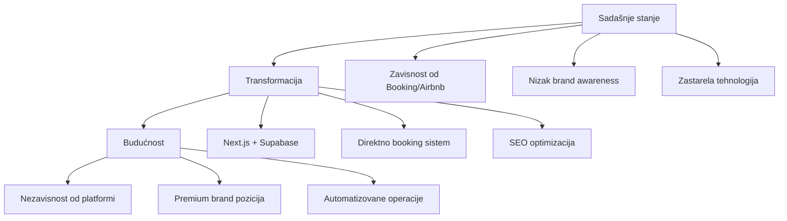
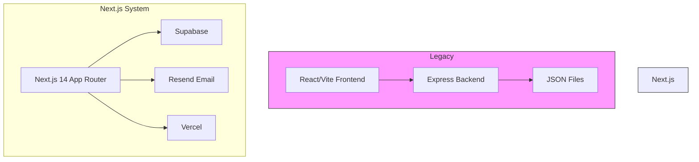
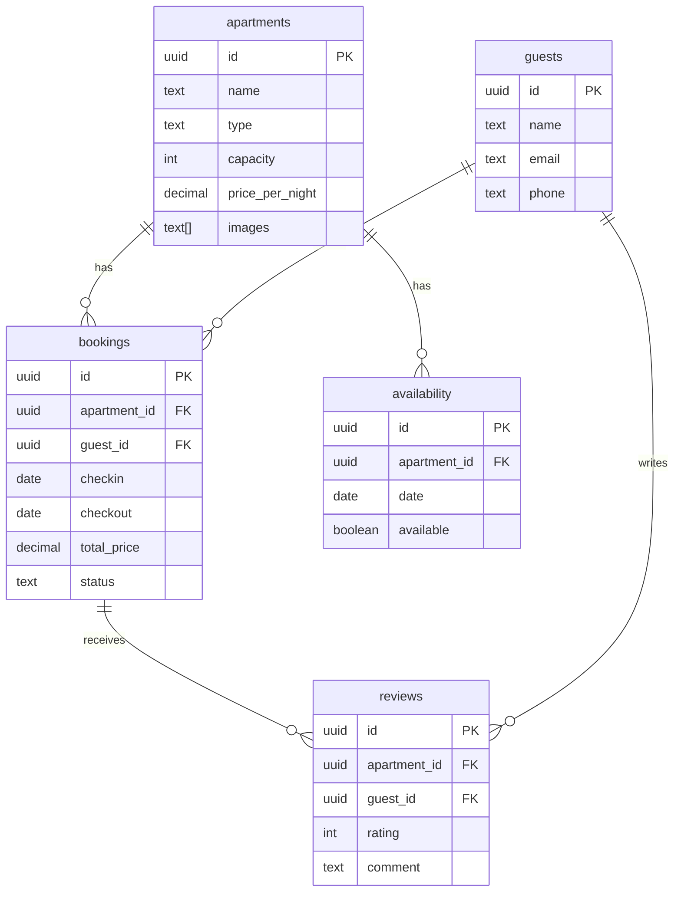
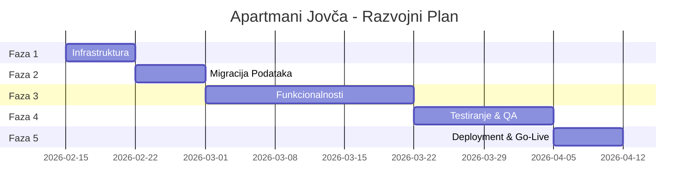

# ROADMAP - Apartmani Jovča

> **Uslovni dokument za vođenje projekta**  
> Verzija: 1.0  
> Datum: Februar 2026  
> Autor: Razvojni tim

---

## Sadržaj

1. [Vizija Projekta](#1-vizija-projekta)
2. [Trenutno Stanje](#2-trenutno-stanje)
3. [Prioritetski Akcioni Plan](#3-prioritetski-akcioni-plan)
4. [Tehnički Zahtevi](#4-tehnički-zahtevi)
5. [Kriterijumi Uspeha](#5-kriterijumi-uspeha)
6. [Procena Rizika](#6-procena-rizika)
7. [Vremenski Okvir](#7-vremenski-okvir)

---

## 1. Vizija Projekta

### Misija

Transformisati **Apartmani Jovča** u vodeću destinaciju za smeštaj na Bovanskom jezeru kroz modernu digitalnu platformu koja omogućava direktne rezervacije, eliminiše zavisnost od skupih platformi, i pozicionira brand kao premium izbor za turiste.

### Primarni Ciljevi

| Cilj | Trenutno | Target |
|------|----------|--------|
| Direktne rezervacije | <10 mesečno | 20+ mesečno |
| Zavisnost od platformi | 80%+ | <40% |
| Google rangiranje | Niska vidljivost | #1 za ključne termine |
| Konverzija sajta | Visok bounce rate | 2-5x poboljšanje |
| Admin vreme | 10h nedeljno | 2h nedeljno |

### Strateška Vrednost



### Ključne Funkcionalnosti

- **Online Booking Sistem** - 4-step proces rezervacije
- **Real-Time Kalendar** - Dostupnost u realnom vremenu
- **Guest Portal** - Upravljanje rezervacijama za goste
- **Admin Panel** - Kompletno upravljanje sadržajem i rezervacijama
- **Email Notifikacije** - Automatske poruke kroz ceo journey
- **WhatsApp Integracija** - Direktna komunikacija
- **Custom Analytics** - Praćenje ponašanja korisnika
- **Multi-language** - Podrška za 4 jezika (SR, EN, IT, DE)

---

## 2. Trenutno Stanje

### Pregled Sistema

Projekat se sastoji od **dva paralelna sistema**:

#### Legacy Sistem (Završen ✅)

| Komponenta | Status | Tehnologija |
|------------|--------|-------------|
| Frontend | Kompletan | React 18 + Vite |
| Backend | Kompletan | Express.js |
| Baza podataka | JSON fajlovi | `backend/data/*.json` |
| Admin Panel | Kompletan | React komponente |
| Upload slika | Implementiran | Lokalni server |
| Višejezičnost | Kompletan | 4 jezika |

**Lokacija:** `frontend/` i `backend/` folderi

#### Next.js Sistem (60-70% Završen 🔄)

| Komponenta | Status | Progres |
|------------|--------|---------|
| Infrastructure Setup | Završen | ✅ 100% |
| Database Schema | Kreirana | ✅ 100% |
| Osnovne Stranice | Implementirane | ✅ 90% |
| Booking Flow | Delimično | 🔄 70% |
| Admin Panel | Struktura | 🔄 50% |
| Guest Portal | Struktura | 🔄 50% |
| Email Templates | Kreirani | ✅ 100% |
| Supabase Functions | Kreirane | 🔄 80% |
| Analytics | Osnovno | 🔄 60% |
| PWA Support | Implementirano | ✅ 90% |

**Lokacija:** `apartmani-jovca-next/` folder

### Šta Nedostaje

#### Kritično (Blokira produkciju)

1. **Supabase Konfiguracija** - Nedostaju environment variables
2. **Data Migracija** - Podaci nisu prebačeni iz JSON u Supabase
3. **Real-Time Kalendar** - Nije povezan sa Supabase
4. **Email Sending** - Resend API nije konfigurisan

#### Važno (Smanjuje funkcionalnost)

5. **Admin Autentifikacija** - Supabase Auth nije povezan
6. **Guest Portal Login** - Magic link nije testiran
7. **WhatsApp Dugme** - Nije povezano sa brojem
8. **Testing** - Nema automatizovanih testova

#### Poželjno (Poboljšava UX)

9. **SEO Optimizacija** - Meta tagovi, sitemap
10. **Performance** - Slike nisu optimizovane
11. **Offline Support** - PWA nije potpuno funkcionalan

### Arhitektura



---

## 3. Prioritetski Akcioni Plan

### Faza 1: Infrastruktura (Prioritet: KRITIČAN)

**Cilj:** Uspostaviti osnovu za rad sistema

#### 1.1 Supabase Setup

- [ ] Kreirati Supabase projekat
- [ ] Konfigurisati database connection
- [ ] Postaviti RLS policies
- [ ] Kreirati API keys

**Environment Variables:**
```env
NEXT_PUBLIC_SUPABASE_URL=https://xxxxx.supabase.co
NEXT_PUBLIC_SUPABASE_ANON_KEY=eyJhbGciOiJIUzI1NiIsInR5cCI6IkpXVCJ9...
SUPABASE_SERVICE_ROLE_KEY=eyJhbGciOiJIUzI1NiIsInR5cCI6IkpXVCJ9...
```

#### 1.2 Vercel Deployment

- [ ] Povezati GitHub repository
- [ ] Konfigurisati environment variables
- [ ] Postaviti custom domain (apartmani-jovca.vercel.app)
- [ ] Testirati deployment

#### 1.3 Resend Email Setup

- [ ] Kreirati Resend account
- [ ] Verifikovati domain
- [ ] Generisati API key

**Environment Variable:**
```env
RESEND_API_KEY=re_xxxxx
```

**Zavisnosti:** Nema  
**Rizik:** Nizak  
**Blokira:** Sve naredne faze

---

### Faza 2: Migracija Podataka (Prioritet: KRITIČAN)

**Cilj:** Prebaciti sve podatke u Supabase

#### 2.1 Content Migracija

- [ ] Migrirati `backend/data/sr.json` → Supabase content table
- [ ] Migrirati `backend/data/en.json` → Supabase content table
- [ ] Migrirati `backend/data/it.json` → Supabase content table
- [ ] Migrirati `backend/data/de.json` → Supabase content table

#### 2.2 Slike Migracija

- [ ] Upload slika u Supabase Storage
- [ ] Ažurirati URL-ove u bazi
- [ ] Testirati učitavanje slika

#### 2.3 Seed Data

- [ ] Kreirati 4 apartmana u bazi
- [ ] Dodati početne cene
- [ ] Dodati test dostupnost

**Zavisnosti:** Faza 1  
**Rizik:** Srednji (gubitak podataka)  
**Blokira:** Faza 3, 4, 5

---

### Faza 3: Kompletiranje Funkcionalnosti (Prioritet: VISOK)

**Cilj:** Završiti sve ključne funkcionalnosti

#### 3.1 Real-Time Kalendar

- [ ] Povezati kalendar sa Supabase
- [ ] Implementirati real-time subscriptions
- [ ] Testirati conflict resolution
- [ ] Optimizovati za mobile

**Datoteke:**
- `apartmani-jovca-next/src/app/[lang]/booking/BookingFlow.tsx`

#### 3.2 Booking Sistem

- [ ] Kompletirati 4-step flow
- [ ] Povezati sa Supabase bookings table
- [ ] Implementirati booking number generaciju
- [ ] Kreirati confirmation page

**API Routes:**
- `apartmani-jovca-next/src/app/api/booking/route.ts`

#### 3.3 Email Notifikacije

- [ ] Konfigurisati Resend sending
- [ ] Testirati sve email template-e
- [ ] Postaviti cron jobs za scheduled emails

**Email Templates:**
- `BookingRequestEmail.tsx`
- `BookingConfirmationEmail.tsx`
- `PreArrivalReminderEmail.tsx`
- `CheckInInstructionsEmail.tsx`
- `ReviewRequestEmail.tsx`

#### 3.4 WhatsApp Integracija

- [ ] Dodati floating WhatsApp button
- [ ] Konfigurisati pre-filled message
- [ ] Dodati business hours indicator

**Broj:** +381693349457

#### 3.5 Admin Panel

- [ ] Kompletirati autentifikaciju
- [ ] Implementirati booking management
- [ ] Dodati content editing
- [ ] Kreirati dashboard

**Datoteke:**
- `apartmani-jovca-next/src/app/admin/AdminDashboard.tsx`

#### 3.6 Guest Portal

- [ ] Implementirati magic link login
- [ ] Kompletirati dashboard
- [ ] Dodati messaging funkcionalnost
- [ ] Kreirati QR kod za check-in

**Datoteke:**
- `apartmani-jovca-next/src/app/portal/PortalDashboard.tsx`

**Zavisnosti:** Faza 2  
**Rizik:** Srednji  
**Blokira:** Faza 4

---

### Faza 4: Testiranje & QA (Prioritet: VISOK)

**Cilj:** Osigurati kvalitet sistema

#### 4.1 Unit Testing

- [ ] Testirati utility funkcije
- [ ] Testirati API routes
- [ ] Testirati komponente

#### 4.2 Integration Testing

- [ ] Testirati booking flow end-to-end
- [ ] Testirati email sending
- [ ] Testirati real-time kalendar

#### 4.3 User Acceptance Testing

- [ ] Testirati kao gost
- [ ] Testirati kao admin
- [ ] Testirati na mobilnim uređajima
- [ ] Testirati sve jezike

#### 4.4 Performance Testing

- [ ] Testirati brzinu učitavanja
- [ ] Testirati Core Web Vitals
- [ ] Optimizovati slike

#### 4.5 Security Testing

- [ ] Testirati RLS policies
- [ ] Testirati autentifikaciju
- [ ] Testirati input validation

**Zavisnosti:** Faza 3  
**Rizik:** Nizak  
**Blokira:** Faza 5

---

### Faza 5: Deployment & Go-Live (Prioritet: KRITIČAN)

**Cilj:** Prebaciti sistem u produkciju

#### 5.1 Pre-Deployment

- [ ] Final code review
- [ ] Environment variables check
- [ ] Database backup
- [ ] DNS konfiguracija

#### 5.2 Deployment

- [ ] Deploy na Vercel production
- [ ] Konfigurisati custom domain
- [ ] Postaviti SSL certificate
- [ ] Konfigurisati redirects

#### 5.3 Post-Deployment

- [ ] Testirati production site
- [ ] Verifikovati email sending
- [ ] Testirati WhatsApp link
- [ ] Monitorisati analytics

#### 5.4 Go-Live

- [ ] Prebaciti DNS na novi sajt
- [ ] Obavestiti stakeholdere
- [ ] Monitorisati prve rezervacije
- [ ] Pripremiti rollback plan

#### 5.5 Post-Launch

- [ ] Praćenje metrika (7 dana)
- [ ] Bug fixes
- [ ] User feedback prikupljanje
- [ ] Dokumentacija ažuriranje

**Zavisnosti:** Faza 4  
**Rizik:** Visok (production issues)  
**Blokira:** Nema (završetak projekta)

---

## 4. Tehnički Zahtevi

### 4.1 Required API Keys & Credentials

| Servis | Svrha | Status |
|--------|-------|--------|
| Supabase Project | Database, Auth, Storage | ⚠️ Potreban |
| Supabase Anon Key | Client-side access | ⚠️ Potreban |
| Supabase Service Role Key | Server-side admin | ⚠️ Potreban |
| Resend API Key | Email sending | ⚠️ Potreban |
| Vercel Account | Hosting | ⚠️ Potreban |
| Domain (apartmani-jovca.vercel.app) | Production URL | ⚠️ Potreban |
| WhatsApp Business | Customer communication | ✅ Postoji |

### 4.2 Environment Variables

**`.env.local` (Development):**
```env
# Supabase
NEXT_PUBLIC_SUPABASE_URL=https://xxxxx.supabase.co
NEXT_PUBLIC_SUPABASE_ANON_KEY=eyJhbGciOiJIUzI1NiIsInR5cCI6IkpXVCJ9...
SUPABASE_SERVICE_ROLE_KEY=eyJhbGciOiJIUzI1NiIsInR5cCI6IkpXVCJ9...

# Resend
RESEND_API_KEY=re_xxxxx

# App
NEXT_PUBLIC_APP_URL=http://localhost:3000
NEXT_PUBLIC_WHATSAPP_NUMBER=381693349457

# Admin
ADMIN_EMAIL=jovca@example.com
ADMIN_PASSWORD_HASH=xxxxx
```

**Vercel Environment Variables:**
- Sve gore navedene promenljive
- `NEXT_PUBLIC_APP_URL=https://apartmani-jovca.vercel.app`

### 4.3 External Services Setup

#### Supabase Konfiguracija

1. **Database:**
   - PostgreSQL 15+
   - 500MB storage (free tier)
   - Point-in-time recovery

2. **Auth:**
   - Email provider enabled
   - Magic links configured
   - Admin role defined

3. **Storage:**
   - `images` bucket created
   - Public access configured
   - CORS settings

4. **Edge Functions:**
   - `booking-confirmation`
   - `pre-arrival-reminder`
   - `checkin-instructions`
   - `review-request`

#### Resend Konfiguracija

1. **Domain Verification:**
   - Add DNS records
   - Verify ownership

2. **Sender Address:**
   - `bookings@apartmani-jovca.vercel.app`

#### Vercel Konfiguracija

1. **Project Settings:**
   - Framework: Next.js
   - Build Command: `npm run build`
   - Output Directory: `.next`

2. **Domain:**
   - Add custom domain
   - Configure DNS

### 4.4 Database Schema



---

## 5. Kriterijumi Uspeha

### 5.1 Faza 1: Infrastruktura

| Kriterijum | Kako Meriti | Target |
|------------|-------------|--------|
| Supabase konekcija | `supabase ping` | ✅ Connected |
| Vercel deployment | URL dostupan | ✅ 200 OK |
| Resend API | Test email | ✅ Delivered |
| Environment vars | Build bez grešaka | ✅ No errors |

### 5.2 Faza 2: Migracija Podataka

| Kriterijum | Kako Meriti | Target |
|------------|-------------|--------|
| Content migracija | Row count u bazi | 4 jezika × 5 sekcija |
| Slike migracija | Storage bucket | Sve slike uploadovane |
| Seed data | Apartments table | 4 apartmana |
| Data integrity | Manual review | ✅ Bez grešaka |

### 5.3 Faza 3: Funkcionalnosti

| Kriterijum | Kako Meriti | Target |
|------------|-------------|--------|
| Booking flow | End-to-end test | ✅ Rezervacija kreirana |
| Real-time kalendar | WebSocket test | ✅ Updates visible |
| Email sending | Inbox test | ✅ Svi emailovi |
| WhatsApp link | Click test | ✅ Opens WhatsApp |
| Admin login | Auth test | ✅ Dashboard access |
| Guest portal | Magic link test | ✅ Portal access |

### 5.4 Faza 4: Testiranje

| Kriterijum | Kako Meriti | Target |
|------------|-------------|--------|
| Unit tests | Jest coverage | >80% |
| E2E tests | Playwright | ✅ All flows pass |
| Performance | Lighthouse | >90 score |
| Mobile | Device testing | ✅ All breakpoints |
| Security | OWASP check | ✅ No vulnerabilities |

### 5.5 Faza 5: Go-Live

| Kriterijum | Kako Meriti | Target |
|------------|-------------|--------|
| Production URL | HTTPS check | ✅ Valid SSL |
| DNS propagation | Global check | ✅ All regions |
| First booking | Real test | ✅ Within 7 days |
| Uptime | Monitoring | >99.9% |
| Error rate | Logs | <0.1% |

### 5.6 Poslovni Kriterijumi (3 meseca post-launch)

| Metrika | Trenutno | Target | Kako Meriti |
|---------|----------|--------|-------------|
| Direktne rezervacije | <10/mes | 20+/mes | Supabase bookings |
| Platform fees | 15-20% | <5% | Finansijski izveštaj |
| Google ranking | Nije vidljiv | Top 3 | Google Search Console |
| Bounce rate | >70% | <40% | Custom analytics |
| Konverzija | <1% | 3-5% | Booking funnel |

---

## 6. Procena Rizika

### 6.1 Tehnički Rizici

| Rizik | Verovatnoća | Uticaj | Mitigacija |
|-------|-------------|--------|------------|
| Supabase downtime | Niska | Visok | Backup plan, monitoring |
| Data loss during migration | Srednja | Visok | Backup pre migracije |
| Email deliverability issues | Srednja | Srednji | SPF/DKIM records, testiranje |
| Performance issues | Srednja | Srednji | Load testing, optimization |
| Security vulnerabilities | Niska | Visok | Security audit, RLS policies |

### 6.2 Poslovni Rizici

| Rizik | Verovatnoća | Uticaj | Mitigacija |
|-------|-------------|--------|------------|
| Low adoption | Srednja | Visok | User testing, marketing |
| Competition response | Visoka | Srednji | Continuous improvement |
| Season timing | Srednja | Visok | Priority scheduling |
| Budget overrun | Niska | Srednji | Phased approach |

### 6.3 Projektni Rizici

| Rizik | Verovatnoća | Uticaj | Mitigacija |
|-------|-------------|--------|------------|
| Scope creep | Visoka | Srednji | Clear requirements |
| Resource availability | Srednja | Srednji | Documentation |
| Integration issues | Srednja | Visok | Thorough testing |
| Third-party API changes | Niska | Srednji | Version pinning |

### 6.4 Contingency Plans

#### Plan A: Normalan tok
- Redovan razvoj po fazama
- Testiranje pre svake faze
- Postepeni rollout

#### Plan B: Kašnjenje
- Prioritizacija kritičnih funkcionalnosti
- MVP pristup
- Paralelni rad gde moguće

#### Plan C: Kritični problemi
- Rollback na legacy sistem
- Incident response team
- Communication plan

---

## 7. Vremenski Okvir

### 7.1 Ukupan Plan



### 7.2 Detaljan Raspored

#### Faza 1: Infrastruktura (1 nedelja)

| Zadatak | Trajanje | Zavisnosti |
|---------|----------|------------|
| Supabase setup | 1 dan | - |
| Vercel deployment | 1 dan | Supabase |
| Resend setup | 1 dan | - |
| Environment config | 1 dan | Svi servisi |
| Testing & verification | 3 dana | Sve konfiguracije |

#### Faza 2: Migracija Podataka (1 nedelja)

| Zadatak | Trajanje | Zavisnosti |
|---------|----------|------------|
| Content migration script | 1 dan | Faza 1 |
| Execute migration | 1 dan | Script |
| Image upload | 2 dana | Content |
| Seed data | 1 dan | Sve tabele |
| Verification | 2 dana | Svi podaci |

#### Faza 3: Funkcionalnosti (3 nedelje)

| Zadatak | Trajanje | Zavisnosti |
|---------|----------|------------|
| Real-time kalendar | 3 dana | Faza 2 |
| Booking sistem | 4 dana | Kalendar |
| Email notifikacije | 3 dana | Booking |
| WhatsApp integracija | 1 dan | - |
| Admin panel | 4 dana | Email |
| Guest portal | 4 dana | Admin |

#### Faza 4: Testiranje & QA (2 nedelje)

| Zadatak | Trajanje | Zavisnosti |
|---------|----------|------------|
| Unit testing | 2 dana | Faza 3 |
| Integration testing | 3 dana | Unit |
| UAT | 3 dana | Integration |
| Performance testing | 2 dana | UAT |
| Bug fixes | 4 dana | Svi testovi |

#### Faza 5: Deployment & Go-Live (1 nedelja)

| Zadatak | Trajanje | Zavisnosti |
|---------|----------|------------|
| Pre-deployment check | 1 dan | Faza 4 |
| Production deployment | 1 dan | Check |
| Post-deployment testing | 2 dana | Deploy |
| DNS switchover | 1 dan | Testing |
| Monitoring setup | 2 dana | DNS |

### 7.3 Milestones

| Milestone | Datum | Kriterijum |
|-----------|-------|------------|
| M1: Infrastructure Ready | Nedelja 1 | Svi servisi konfigurisani |
| M2: Data Migrated | Nedelja 2 | Svi podaci u Supabase |
| M3: Features Complete | Nedelja 5 | Sve funkcionalnosti rade |
| M4: Testing Passed | Nedelja 7 | Svi testovi prolaze |
| M5: Production Live | Nedelja 8 | Sajt dostupan na domenu |

### 7.4 Resursi

| Resurs | Potrebno | Dostupno |
|--------|----------|----------|
| Developer | 1 full-time | ✅ |
| Designer | Part-time | ✅ |
| QA Tester | Part-time | ⚠️ Može biti potreban |
| Project Manager | Part-time | ✅ |

---

## Apendiks

### A. Referentne Datoteke

| Datoteka | Svrha |
|----------|-------|
| [`!1Epic_Brief__End-to-End_Transformacija_Apartmani_Jovča.md`](apartmani-jovca-next/!1Epic_Brief__End-to-End_Transformacija_Apartmani_Jovča.md) | Poslovni kontekst |
| [`!3Tech_Plan__Next.js_+_Supabase_Architecture.md`](apartmani-jovca-next/!3Tech_Plan__Next.js_+_Supabase_Architecture.md) | Tehnička arhitektura |
| [`!2Core_Flows__Discovery_→_Booking_→_Post-Booking_Journey.md`](apartmani-jovca-next/!2Core_Flows__Discovery_→_Booking_→_Post-Booking_Journey.md) | User flows |
| [`20260213000000_initial_schema.sql`](apartmani-jovca-next/supabase/migrations/20260213000000_initial_schema.sql) | Database schema |

### B. Korisni Linkovi

- [Supabase Dashboard](https://supabase.com/dashboard)
- [Vercel Dashboard](https://vercel.com/dashboard)
- [Resend Dashboard](https://resend.com/dashboard)
- [Next.js Documentation](https://nextjs.org/docs)
- [TailwindCSS Documentation](https://tailwindcss.com/docs)

### C. Kontakt Informacije

| Uloga | Ime | Kontakt |
|-------|-----|---------|
| Vlasnik | - | - |
| Developer | Milan Tošič Toške | mtosic0450@gmail.com |
| Telefon | - | +381693349457 |

---

**Document Status:** Draft  
**Last Updated:** Februar 2026  
**Next Review:** Pre početka svake faze
